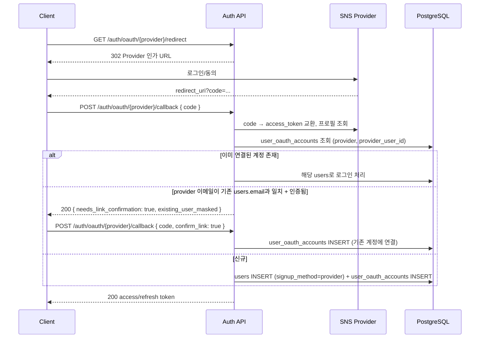
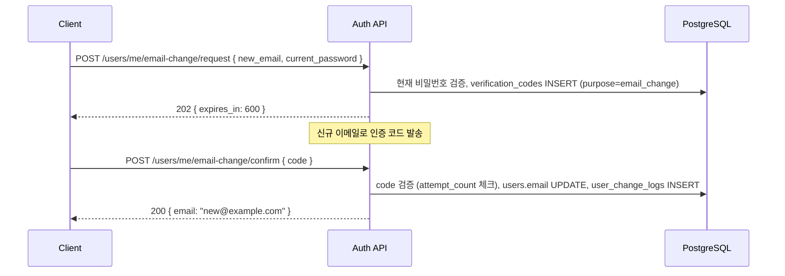

# TCG 오리파 플랫폼 — API 명세서

`docs/ERD.md`의 데이터 모델을 기반으로 한 REST API 설계. FastAPI 구현을 전제로 하며, 서비스 경계는
프로젝트 계획서 §2 아키텍처(Auth / Card / Oripa / Inventory / Payment / Event / Admin)를 따른다.

## 목차

0. [공통 규약](#0-공통-규약)
1. [Auth & User Service](#1-auth--user-service)
2. [Card Catalog Service](#2-card-catalog-service-public)
3. [Oripa (뽑기) Service](#3-oripa-뽑기-service)
4. [Inventory & Shipping Service](#4-inventory--shipping-service)
5. [Payment & Wallet Service](#5-payment--wallet-service)
6. [Event Service](#6-event-service)
7. [Admin Service](#7-admin-service)
8. [WebSocket — 실시간 뽑기 피드](#8-websocket--실시간-뽑기-피드)
9. [에러 코드 표준](#9-에러-코드-표준)

---

## 0. 공통 규약

**Base URL**: `https://api.<domain>/api/v1`

**인증**
- `Authorization: Bearer <access_token>` (JWT, 만료 15분)
- 만료 시 `POST /auth/refresh`로 Refresh Token Rotation
- Admin 라우트(`/admin/*`)는 `role=admin` 이상 + 2FA 통과 세션 클레임(`amr: ["mfa"]`) 필수

**멱등성**
- 상태를 변경하는 금전/뽑기 API(`POST /wallet/charges`, `POST /oripa-packs/{id}/draws`)는 `Idempotency-Key` 헤더 필수.
  동일 키 재요청 시 최초 응답을 그대로 반환(신규 처리 안 함).

**페이지네이션**
- 커서 기반: 쿼리 파라미터 `cursor`, `limit`(기본 20, 최대 100)
- 응답 공통 포맷:
```json
{
  "data": [ ... ],
  "next_cursor": "eyJpZCI6MTIzfQ==",
  "has_more": true
}
```

**에러 포맷 (RFC 7807 변형)**
```json
{
  "error": {
    "code": "PACK_SOLD_OUT",
    "message": "이 팩은 이미 완판되었습니다.",
    "request_id": "req_9f2c..."
  }
}
```

**레이트 리밋**: 응답 헤더 `X-RateLimit-Limit`, `X-RateLimit-Remaining`, `X-RateLimit-Reset` (Redis 기반, IP+계정 단위).

---

## 1. Auth & User Service

| Method | Path | Auth | 설명 |
|---|---|---|---|
| POST | `/auth/register` | - | 이메일 회원가입 (가입 직후 `POST /auth/verify-email/request`로 이메일 인증 발송) |
| POST | `/auth/login` | - | 이메일 로그인 → access/refresh 토큰 발급 |
| GET | `/auth/oauth/{provider}/redirect` | - | OAuth 인가 URL 리다이렉트 (`provider`: kakao, naver, google, apple) |
| POST | `/auth/oauth/{provider}/callback` | - | OAuth 콜백 처리 → 신규면 자동 회원가입, 기존이면 로그인 (§1.1) |
| POST | `/auth/refresh` | Refresh Token | Access Token 재발급 (Rotation) |
| POST | `/auth/logout` | Bearer | 현재 Refresh Token 폐기 |
| POST | `/auth/2fa/enable` | Bearer | TOTP 시크릿 발급 (QR용 otpauth URI 반환) |
| POST | `/auth/2fa/verify` | Bearer | TOTP 코드 검증 후 2FA 활성화 확정 |
| GET | `/users/me` | Bearer | 내 프로필 조회 (연결된 SNS 계정 목록 포함) |
| PATCH | `/users/me` | Bearer | 닉네임/프로필이미지 등 민감하지 않은 정보 즉시 수정 |
| GET | `/users/me/oauth-accounts` | Bearer | 연결된 SNS 계정 목록 |
| POST | `/users/me/oauth-accounts/link` | Bearer | 로그인 상태에서 추가 SNS 계정 연결 |
| DELETE | `/users/me/oauth-accounts/{provider}` | Bearer | SNS 계정 연결 해제 |
| POST | `/users/me/email-change/request` | Bearer + 비밀번호 재확인 | 신규 이메일로 인증 코드 발송 |
| POST | `/users/me/email-change/confirm` | Bearer | 인증 코드 검증 후 이메일 변경 확정 |
| POST | `/users/me/phone-change/request` | Bearer | 신규 전화번호로 SMS 인증 코드 발송 |
| POST | `/users/me/phone-change/confirm` | Bearer | 인증 코드 검증 후 전화번호 변경 확정 |
| POST | `/users/me/password` | Bearer + 현재 비밀번호 확인 | 비밀번호 변경 (전 세션 강제 로그아웃) |
| GET | `/users/me/change-logs` | Bearer | 본인 정보 변경 이력 조회 |
| GET | `/users/me/addresses` | Bearer | 배송지 목록 |
| POST | `/users/me/addresses` | Bearer | 배송지 등록 |
| PATCH | `/users/me/addresses/{id}` | Bearer | 배송지 수정 |
| DELETE | `/users/me/addresses/{id}` | Bearer | 배송지 삭제 |

**POST /auth/login — 요청/응답 예시**
```json
// Request
{ "email": "user@example.com", "password": "..." }

// 200 Response
{
  "access_token": "eyJ...",
  "refresh_token": "8f3a...",
  "token_type": "Bearer",
  "expires_in": 900,
  "user": { "id": 101, "nickname": "otaku_hunter", "role": "user" }
}
```
- 실패 시 `401 INVALID_CREDENTIALS`. 5회 연속 실패 시 캡차 요구(`428 CAPTCHA_REQUIRED`).

### 1.1 SNS 회원가입/로그인 (Kakao, Naver, Google, Apple)

지원 우선순위(한국 시장 기준): **카카오 → 네이버 → 구글 → 애플**. 4개 provider 모두 동일한 콜백 계약을
따르며, provider별 클라이언트 구현만 전략 패턴으로 분리한다(`AppleOAuthClient`는 최초 로그인에만
이름이 내려오고 private relay 이메일을 쓸 수 있다는 점만 별도 처리).



**POST /auth/oauth/{provider}/callback — 응답 예시**
```json
// 신규 가입 또는 기존 연결 계정 로그인
{
  "access_token": "eyJ...",
  "refresh_token": "8f3a...",
  "is_new_user": true,
  "user": { "id": 205, "nickname": "리자몽매니아", "signup_method": "kakao" }
}

// 계정 연결 확인이 필요한 경우 (동일 이메일의 기존 이메일 가입 계정 존재)
{
  "needs_link_confirmation": true,
  "existing_user_masked": { "email_masked": "us***@example.com", "signup_method": "email" },
  "link_token": "lnk_7f2a..."
}
```
- 연결 확인이 필요한 응답을 받으면 클라이언트는 사용자에게 "기존 계정과 연결하시겠습니까?"를 안내 후
  `POST /auth/oauth/{provider}/callback`에 `link_token` + `confirm_link: true`를 재전송해 확정한다.
- 이메일이 provider에서 인증되지 않은 상태(예: Apple private relay)로 왔다면 자동 연결 제안 없이 신규 계정으로 분리 생성(§ERD.md `user_oauth_accounts.email_verified_by_provider`).
- 이미 로그인 상태에서 추가 SNS를 연결하려면 `POST /users/me/oauth-accounts/link`(Bearer 필요, code 교환 흐름 동일).
- `DELETE /users/me/oauth-accounts/{provider}`는 연결 해제 후 로그인 수단이 하나도 남지 않으면(비밀번호 미설정 + SNS 계정 1개뿐) `409 LAST_LOGIN_METHOD` 반환.

### 1.2 유저 정보 수정 (민감 정보 2단계 인증)

이메일·전화번호·비밀번호 변경은 계정 탈취 시 피해가 큰 변경이므로 요청(request)/확정(confirm) 2단계로 분리한다.



```json
// POST /users/me/email-change/request
// Request
{ "new_email": "new@example.com", "current_password": "..." }
// 202 Response
{ "expires_in": 600 }

// POST /users/me/email-change/confirm
// Request
{ "code": "482913" }
// 200 Response
{ "email": "new@example.com" }
```
- 실패: `401 INVALID_PASSWORD`, `409 EMAIL_ALREADY_IN_USE`, `422 INVALID_CODE`(5회 초과 시 `429 TOO_MANY_ATTEMPTS`, 코드 재발급 필요).
- `POST /users/me/password` 성공 시 현재 세션을 제외한 모든 `refresh_tokens`를 `revoked_at` 처리(다른 기기 강제 로그아웃).
- 모든 변경은 성공/실패 관계없이 `user_change_logs`에 기록되며, `GET /users/me/change-logs`로 본인이 직접 열람 가능(계정 이상 징후 셀프 체크).

---

## 2. Card Catalog Service (Public)

| Method | Path | Auth | 설명 |
|---|---|---|---|
| GET | `/games` | - | 지원 게임 목록 (Pokemon, One Piece, Yu-Gi-Oh! 등) |
| GET | `/games/{game_code}/sets` | - | 게임별 확장팩/세트 목록 |
| GET | `/cards` | - | 카드 검색 (`?game=&set=&rarity=&q=&cursor=`) |
| GET | `/cards/{id}` | - | 카드 상세 (공식 이미지 + attributes) |
| GET | `/cards/{id}/price-history` | - | 시세 그래프 데이터 (§8 추가 제안 기능) |

**GET /cards/{id} — 응답 예시**
```json
{
  "id": 5821,
  "game": "pokemon",
  "set": { "code": "sv4a", "name": "Shiny Treasure ex" },
  "card_number": "080/190",
  "name": "리자몽 ex",
  "rarity": "SAR",
  "attributes": { "hp": 330, "type": "Fire", "regulation_mark": "H" },
  "images": [
    { "type": "official_front", "url": "https://cdn.../front.webp" }
  ]
}
```

---

## 3. Oripa (뽑기) Service

| Method | Path | Auth | 설명 |
|---|---|---|---|
| GET | `/oripa-packs` | - | 판매중/예정 팩 목록 (`?game=&status=`) |
| GET | `/oripa-packs/{id}` | - | 팩 상세 — 잔여 구수, **등급별 잔여 수량 실시간 공개**(투명성, §8) |
| GET | `/oripa-packs/{id}/proof` | - | Provably Fair 증명 정보 (커밋 해시, sold_out 후 seed reveal) |
| POST | `/oripa-packs/{id}/draws` | Bearer + Idempotency-Key | 1회 뽑기 실행 |
| GET | `/oripa-packs/{id}/draws/{draw_id}` | Bearer | 특정 뽑기 결과 상세 |
| GET | `/users/me/draws` | Bearer | 내 뽑기 이력 |

**GET /oripa-packs/{id} — 응답 예시 (투명성 핵심 필드)**
```json
{
  "id": 42,
  "name": "포켓몬 SAR 이상 확정 오리파",
  "game": "pokemon",
  "price_per_draw": 3000,
  "total_slots": 100,
  "remaining_slots": 37,
  "status": "on_sale",
  "last_one_bonus_enabled": true,
  "grade_summary": [
    { "grade": "SS", "total": 1, "remaining": 1 },
    { "grade": "S", "total": 5, "remaining": 2 },
    { "grade": "A", "total": 20, "remaining": 9 },
    { "grade": "participation", "total": 74, "remaining": 25 }
  ],
  "server_seed_hash": "b7e2...ff01"
}
```

**POST /oripa-packs/{id}/draws — 처리 흐름**
```mermaid
sequenceDiagram
    participant C as Client
    participant API as Oripa API
    participant Redis as Redis (분산락)
    participant DB as PostgreSQL

    C->>API: POST /draws (Idempotency-Key)
    API->>Redis: 락 획득 pack:{id}:lock
    API->>DB: BEGIN; SELECT balance FOR UPDATE (wallet)
    API->>DB: 잔액 검증, ledger_entries INSERT(draw_spend, -price)
    API->>DB: SELECT available slots FOR UPDATE SKIP LOCKED
    API->>API: secrets.randbelow(remaining_count)로 슬롯 선택
    API->>DB: slot.status='drawn', draw_logs INSERT, user_inventory INSERT
    API->>DB: COMMIT
    API->>Redis: 락 해제
    API-->>C: 200 draw 결과 (연출용 payload)
    API--)C: WS 브로드캐스트 (실시간 피드)
```

```json
// Request
POST /oripa-packs/42/draws
Idempotency-Key: 7c1b6e2a-...

// 200 Response
{
  "draw_id": 991234,
  "pack_id": 42,
  "slot_no": 63,
  "grade": "A",
  "physical_card": {
    "id": 88213,
    "card_name": "피카츄 V",
    "condition_grade": "S",
    "is_graded": false,
    "images": ["https://cdn.../photo1.webp"]
  },
  "points_spent": 3000,
  "wallet_balance_after": 47000,
  "remaining_slots": 36
}
```
- 실패: `409 PACK_SOLD_OUT`, `402 INSUFFICIENT_BALANCE`, `423 PACK_LOCKED`(락 획득 실패, 재시도 유도).

**GET /oripa-packs/{id}/proof — sold_out 이전/이후**
```json
// on_sale 상태
{ "status": "on_sale", "server_seed_hash": "b7e2...ff01", "reveal_available": false }

// settled 상태 (검증 가능)
{
  "status": "settled",
  "server_seed_hash": "b7e2...ff01",
  "server_seed": "f3a9c1...",
  "slot_mapping": [ { "slot_no": 1, "grade": "participation", "physical_card_id": 8811 }, ... ],
  "verify_instruction": "SHA256(server_seed || slot_mapping_json) 계산 결과가 server_seed_hash와 일치하는지 확인하세요."
}
```

---

## 4. Inventory & Shipping Service

| Method | Path | Auth | 설명 |
|---|---|---|---|
| GET | `/users/me/inventory` | Bearer | 보유 카드 목록 (`?status=held`) |
| POST | `/shipping-requests` | Bearer | 배송 신청 (여러 인벤토리 항목 묶음 가능) |
| GET | `/shipping-requests/{id}` | Bearer | 배송 신청 상세/추적 |
| GET | `/users/me/shipping-requests` | Bearer | 내 배송 신청 이력 |
| POST | `/refund-requests` | Bearer | 포인트 환급(매입) 신청 |
| GET | `/refund-requests/{id}` | Bearer | 환급 신청 상태 조회 |

**POST /shipping-requests — 요청 예시**
```json
{
  "address_id": 12,
  "user_inventory_ids": [88213, 88214, 88250]
}
```
```json
// 201 Response
{
  "id": 5501,
  "status": "requested",
  "items": [88213, 88214, 88250],
  "requested_at": "2026-07-17T10:00:00Z"
}
```

**POST /refund-requests — 요청/응답 예시**
```json
// Request
{ "user_inventory_id": 88250 }

// 201 Response
{ "id": 771, "status": "pending", "estimated_refund_points": 800 }
```
- 승인(`admin`) 시 `ledger_entries`에 `refund_credit` 자동 기록되며 `status=paid`로 전환.

---

## 5. Payment & Wallet Service

| Method | Path | Auth | 설명 |
|---|---|---|---|
| GET | `/users/me/wallet` | Bearer | 포인트 잔액 조회 |
| POST | `/wallet/charges` | Bearer + Idempotency-Key | 결제 요청 생성 (PG 리다이렉트/승인용 정보 반환) |
| POST | `/webhooks/payments/{provider}` | 서명 검증(HMAC) | PG 웹훅 콜백 (toss, portone) — server-to-server |
| GET | `/users/me/ledger` | Bearer | 포인트 증감 원장 이력 |

**POST /wallet/charges — 요청/응답 예시**
```json
// Request
{ "amount": 50000, "method": "card", "pg_provider": "toss" }

// 200 Response
{
  "payment_transaction_id": 33012,
  "status": "pending",
  "pg_checkout_url": "https://pay.toss.im/...",
  "amount": 50000
}
```

**POST /webhooks/payments/{provider} — 검증 절차**
1. `X-Signature` 헤더를 PG 공개 검증 규칙(HMAC-SHA256)으로 재계산 후 대조 — 불일치 시 `401` 즉시 반환.
2. `payment_transactions.pg_tid` 존재 여부로 중복 웹훅 무시(이미 `approved`면 `200 OK`만 반환, 재처리 없음).
3. 서버측 금액 재검증: 웹훅 `amount`가 원 요청 `payment_transactions.amount`와 다르면 `422 AMOUNT_MISMATCH` 처리 후 관리자 알림.
4. 승인 확정 시 트랜잭션: `payment_transactions.status='approved'` + `ledger_entries` INSERT(`charge`, `idempotency_key = pg_tid`) + `wallets.balance` 갱신을 단일 DB 트랜잭션으로 커밋.

```json
// 200 Response (조회용)
GET /users/me/wallet
{ "balance": 47000, "updated_at": "2026-07-17T09:55:00Z" }
```

---

## 6. Event Service

| Method | Path | Auth | 설명 |
|---|---|---|---|
| POST | `/events/attendance/check-in` | Bearer | 당일 출석 체크 (1일 1회) |
| GET | `/events/attendance/status` | Bearer | 연속 출석 현황 |
| POST | `/coupons/redeem` | Bearer | 쿠폰 코드 등록 |
| GET | `/rankings` | - | 랭킹 조회 (`?period=weekly`) |
| POST | `/referrals/invite` | Bearer | 초대 코드 발급/조회 |
| GET | `/events` | - | 진행중 이벤트(한정 오리파, 룰렛 등) 목록 |

**POST /events/attendance/check-in — 응답 예시**
```json
{ "streak_count": 5, "reward_points": 100, "wallet_balance_after": 47100 }
```
- 중복 체크인 시 `409 ALREADY_CHECKED_IN`.

**POST /coupons/redeem — 응답 예시**
```json
// Request
{ "code": "WELCOME2026" }

// 200 Response
{ "coupon_type": "fixed_points", "value": 3000, "wallet_balance_after": 50100 }
```
- 실패: `404 COUPON_NOT_FOUND`, `409 COUPON_ALREADY_REDEEMED`, `410 COUPON_EXPIRED`.

---

## 7. Admin Service

모든 엔드포인트 `role=admin` 이상 + 2FA 세션 필수. 성공/실패 관계없이 `audit_logs` 기록.

### 7.1 카드 마스터 관리 & 데이터 수집 파이프라인
| Method | Path | 설명 |
|---|---|---|
| POST | `/admin/cards` | 카드 단건 등록 |
| PATCH | `/admin/cards/{id}` | 카드 수정 (`locked_fields`에 잠글 필드 지정 가능) |
| POST | `/admin/cards/bulk-import` | CSV 대량 업로드 (소스 없는 게임 대응) |
| POST | `/admin/card-sets` | 세트 등록 |
| POST | `/admin/card-sync/{source}/trigger` | 수집 파이프라인 수동 실행 (`source`: pokemontcg_io, ygoprodeck, crawler_onepiece, crawler_ws, crawler_unionarena) |
| GET | `/admin/card-sync/jobs` | 동기화 실행 이력 조회 (`?status=failed`) |
| GET | `/admin/card-sync/review-queue` | 자동 반영 보류된 변경분 조회 |
| POST | `/admin/card-sync/review-queue/{id}/approve` | 리뷰 항목 승인 → `cards`에 반영 |
| POST | `/admin/card-sync/review-queue/{id}/reject` | 리뷰 항목 반려 |

**GET /admin/card-sync/review-queue — 응답 예시**
```json
{
  "data": [
    {
      "id": 501,
      "sync_job_id": 88,
      "card_id": 5821,
      "change_type": "field_update",
      "diff": { "rarity": { "old": "SR", "new": "SAR" } },
      "status": "pending"
    }
  ]
}
```
- 신규 카드 대량 등록(예: 확장팩 발매), 가격/희귀도 급변 등 임계치를 초과하는 변경은 자동 반영되지 않고 이 큐에 쌓인다 (§ERD.md §10 참고). 단순 오탈자·이미지 URL 갱신 등은 즉시 반영되어 큐에 나타나지 않는다.
- `cards.locked_fields`로 잠근 필드는 수집 파이프라인이 애초에 diff 대상에서 제외 — 관리자가 수동 보정한 값이 다음 동기화에서 덮어써지지 않음.

### 7.2 실물 재고 관리
| Method | Path | 설명 |
|---|---|---|
| POST | `/admin/physical-cards` | 실물 카드 개체 입고 등록 (그레이딩/상태 정보 포함) |
| POST | `/admin/physical-cards/{id}/images` | 실물 촬영 이미지 업로드 (자동 리사이즈/워터마크) |
| GET | `/admin/physical-cards?status=in_stock` | 재고 조회 |
| POST | `/admin/physical-cards/stocktake` | 재고 실사 등록 (DB-실물 불일치 보정) |

### 7.3 오리파 팩 관리
| Method | Path | 설명 |
|---|---|---|
| POST | `/admin/oripa-packs` | 팩 생성 (draft) — 등급별 구성, 총 구수, 구당 가격 |
| POST | `/admin/oripa-packs/{id}/slots` | 슬롯-실물 매핑 대량 등록 |
| POST | `/admin/oripa-packs/{id}/publish` | 셔플 실행 + `server_seed_hash` 커밋, `status=on_sale` 전환 |
| POST | `/admin/oripa-packs/{id}/settle` | `server_seed` 공개(reveal), `status=settled` 전환 |

**POST /admin/oripa-packs/{id}/publish — 응답 예시**
```json
{
  "id": 42,
  "status": "on_sale",
  "server_seed_hash": "b7e2...ff01",
  "published_at": "2026-07-17T09:00:00Z"
}
```
- 이 시점 이후 슬롯-실물 매핑은 불변(수정 API 없음, 오직 `settle`에서 reveal만 가능) — 조작 원천 차단.

### 7.4 유저/재무 관리
| Method | Path | 설명 |
|---|---|---|
| GET | `/admin/users` | 유저 목록/검색 |
| GET | `/admin/users/{id}` | 유저 상세 (연결 SNS 계정, 변경 이력 요약 포함) |
| PATCH | `/admin/users/{id}` | 관리자에 의한 유저 정보 강제 수정 (닉네임/이메일/전화번호/배송지) |
| PATCH | `/admin/users/{id}/status` | 계정 정지/복구 |
| GET | `/admin/users/{id}/change-logs` | 해당 유저의 전체 변경 이력(본인+관리자) 조회 |
| GET | `/admin/refund-requests?status=pending` | 환급 신청 대기열 |
| POST | `/admin/refund-requests/{id}/approve` | 환급 승인 (ledger 반영) |
| POST | `/admin/shipping-requests/{id}/ship` | 송장번호 등록, 배송 처리 |

**PATCH /admin/users/{id} — 요청/응답 예시**
```json
// Request
{ "phone": "010-1234-5678", "reason": "CS 요청에 따른 배송지 연락처 정정" }

// 200 Response
{ "id": 205, "phone_masked": "010-****-5678", "updated_at": "2026-07-17T11:00:00Z" }
```
- 본인 확인 절차(이메일/SMS 인증) 없이 즉시 반영되지만, `reason` 필드는 필수이며 `user_change_logs.changed_by='admin'` + `admin_user_id` + `audit_logs`에 이중 기록.

### 7.5 대시보드 & 감사
| Method | Path | 설명 |
|---|---|---|
| GET | `/admin/dashboard/overview` | 전체 매출/가입/뽑기 지표 |
| GET | `/admin/dashboard/packs/{id}/pl` | 팩별 매출-원가(`acquired_cost` 합산)-마진 |
| GET | `/admin/audit-logs` | 관리자 액션 감사 로그 조회 |

---

## 8. WebSocket — 실시간 뽑기 피드

`wss://api.<domain>/ws/feed`

- 인증 불필요(공개 피드), 연결 시 최근 20건 스냅샷 전송 후 실시간 브로드캐스트.
- 개인정보 보호를 위해 닉네임은 마스킹(`ot***_hunter`), 배송지 등 민감정보 미포함.

```json
// Server → Client push
{
  "type": "draw",
  "pack_name": "포켓몬 SAR 이상 확정 오리파",
  "nickname_masked": "ot***_hunter",
  "grade": "S",
  "card_name": "리자몽 ex SAR",
  "timestamp": "2026-07-17T10:03:21Z"
}
```
- 클라이언트 → 서버 메시지는 없음(단방향 push). 재연결 시 `Last-Event-ID` 유사 커서로 유실 구간 보정(`GET /oripa-packs/{id}/draws?since=`로 폴백 조회 가능).

---

## 9. 에러 코드 표준

| HTTP | code | 설명 |
|---|---|---|
| 400 | `VALIDATION_ERROR` | 요청 스키마 검증 실패 |
| 401 | `INVALID_CREDENTIALS` / `TOKEN_EXPIRED` | 인증 실패 |
| 402 | `INSUFFICIENT_BALANCE` | 포인트 잔액 부족 |
| 403 | `FORBIDDEN` | 권한 부족 (role/2FA 미충족) |
| 404 | `NOT_FOUND` | 리소스 없음 |
| 409 | `PACK_SOLD_OUT` / `ALREADY_CHECKED_IN` / `COUPON_ALREADY_REDEEMED` | 상태 충돌 |
| 410 | `COUPON_EXPIRED` | 만료된 리소스 사용 시도 |
| 422 | `AMOUNT_MISMATCH` | PG 웹훅 금액 불일치 |
| 423 | `PACK_LOCKED` | 동시 뽑기 락 획득 실패 (재시도 유도) |
| 428 | `CAPTCHA_REQUIRED` | 반복 실패로 캡차 요구 |
| 429 | `RATE_LIMITED` | 레이트 리밋 초과 |
| 500 | `INTERNAL_ERROR` | 서버 오류 |
| 401 | `INVALID_PASSWORD` | 민감 정보 변경 시 현재 비밀번호 재확인 실패 |
| 409 | `EMAIL_ALREADY_IN_USE` | 이메일 변경/SNS 연결 시 대상 이메일이 이미 사용 중 |
| 422 | `INVALID_CODE` | 이메일/전화번호 변경 인증 코드 불일치 |
| 429 | `TOO_MANY_ATTEMPTS` | 인증 코드 시도 횟수 초과, 재발급 필요 |
| 409 | `LAST_LOGIN_METHOD` | 마지막 남은 로그인 수단(SNS 계정) 연결 해제 시도 |
