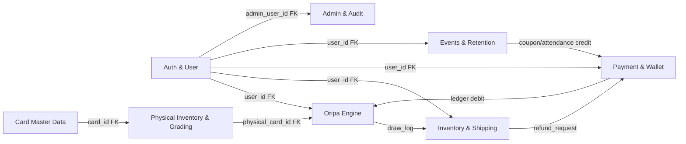
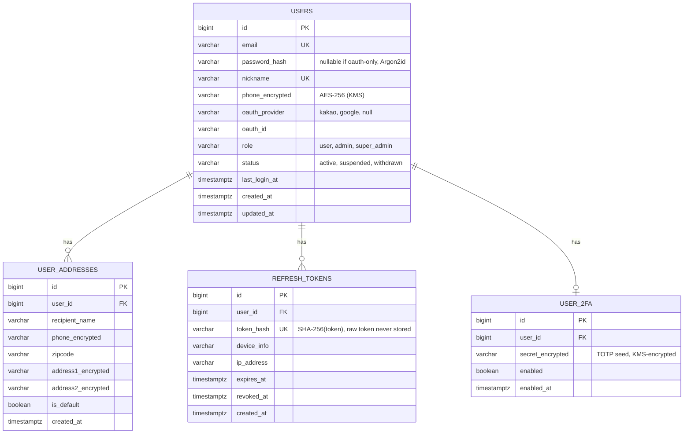
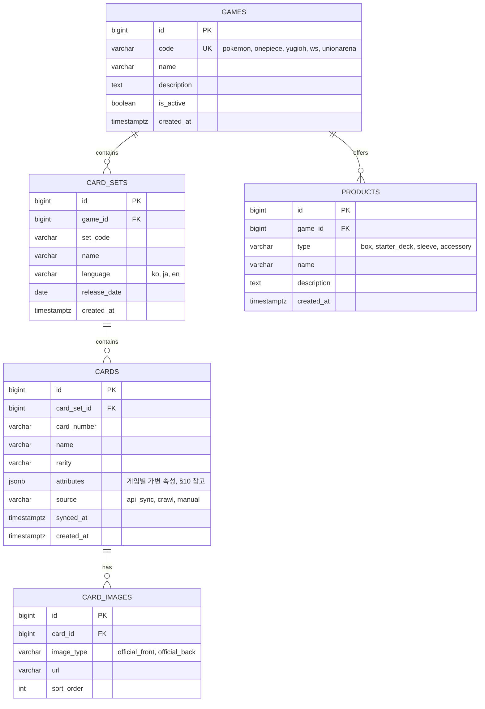
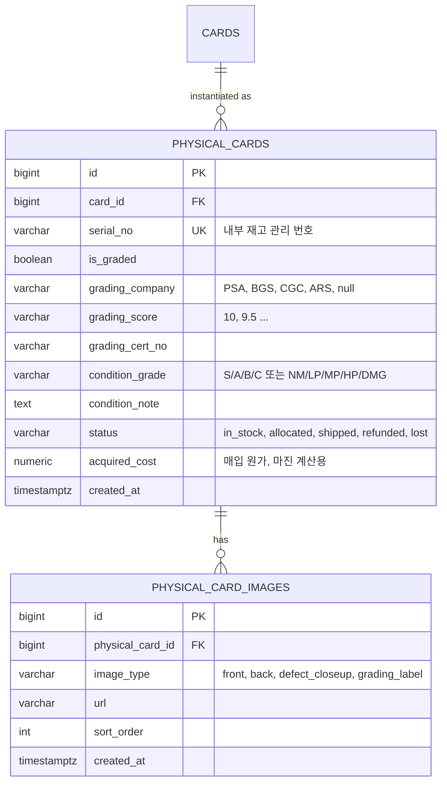

# TCG 오리파 플랫폼 — ERD (데이터 모델 설계)

프로젝트 계획서(§2, §3, §4, §5, §7)를 기반으로 한 엔티티 관계 설계. DB는 PostgreSQL 16을 기준으로 하며,
게임별 가변 속성은 JSONB로, 상태값은 Postgres ENUM 타입으로 표현한다. 모든 테이블은 `id BIGINT
GENERATED ALWAYS AS IDENTITY PK`, `created_at timestamptz DEFAULT now()`를 공통으로 가진다(표에서는
생략하지 않고 명시).

## 목차

1. [전체 도메인 개요](#1-전체-도메인-개요)
2. [Auth & User](#2-auth--user)
3. [Card Master Data](#3-card-master-data)
4. [Physical Inventory & Grading](#4-physical-inventory--grading)
5. [Oripa (뽑기) Engine](#5-oripa-뽑기-engine)
6. [User Inventory & Shipping](#6-user-inventory--shipping)
7. [Payment & Wallet (복식 원장)](#7-payment--wallet-복식-원장)
8. [Events & Retention](#8-events--retention)
9. [Admin & Audit](#9-admin--audit)
10. [설계 노트](#10-설계-노트)

---

## 1. 전체 도메인 개요



- **Auth & User**: 전 도메인의 기준(anchor) 엔티티인 `users`를 소유.
- **Card Master Data → Physical Inventory**: 카드 마스터 1건에 실물 개체(`physical_cards`)가 N건 매핑(동일 카드라도 그레이딩/상태가 다른 개체가 여러 장 존재).
- **Physical Inventory → Oripa Engine**: 팩의 각 슬롯(`oripa_slots`)은 실물 카드 1장에 1:1로 고정 매핑되어 오버셀을 원천 차단.
- **Oripa Engine → Inventory & Shipping**: 뽑기 결과가 `user_inventory`로 이동, 이후 배송 또는 환급 분기.
- **Payment & Wallet**: 모든 포인트 증감(충전/뽑기 차감/환급/이벤트 지급)은 `ledger_entries`에 원자적으로 기록되며 `wallets.balance`는 파생 캐시.

---

## 2. Auth & User



**설계 포인트**
- Refresh Token Rotation: 매 갱신 시 기존 토큰 `revoked_at` 세팅 후 신규 행 삽입. 탈취 감지를 위해 재사용 시도 시 해당 유저의 전체 세션 강제 만료.
- 배송지는 컬럼 단위 암호화(AES-256, KMS). 인덱싱이 필요한 zipcode만 평문 유지.
- `role`은 admin 전용 라우트 게이트에 사용, 세분화된 권한은 §9 `admin_permissions` 참고.

---

## 3. Card Master Data



**설계 포인트**
- `cards.attributes`(JSONB)로 게임별 스키마 차이를 흡수 — 별도 마이그레이션 없이 신규 게임 추가 가능.
- `(card_set_id, card_number)` 복합 UNIQUE로 동일 세트 내 중복 등록 방지.
- `source`로 API 동기화/크롤링/수동 입력 이력을 구분해 배치 재동기화 시 수동 보정 데이터 덮어쓰기 방지.

---

## 4. Physical Inventory & Grading



**설계 포인트**
- `physical_cards`가 실물 재고의 **단일 진실 공급원(SSOT)**. `oripa_slots.physical_card_id`가 여기를 참조하므로 슬롯:실물 = 1:1이 DB 레벨(UNIQUE 제약)로 강제됨.
- `status = allocated`는 팩에 배치되었지만 아직 안 뽑힌 상태, `shipped`/`refunded`는 §6 인벤토리 처리 결과와 동기화.
- 실물 촬영 이미지는 관리자 업로드 시 리사이즈·워터마크 파이프라인(Celery)을 거쳐 `physical_card_images`에 다건 저장.

---

## 5. Oripa (뽑기) Engine

```mermaid
erDiagram
    GAMES ||--o{ ORIPA_PACKS : "themed for"
    ORIPA_PACKS ||--o{ ORIPA_SLOTS : contains
    PHYSICAL_CARDS ||--|| ORIPA_SLOTS : "allocated 1:1"
    USERS ||--o{ DRAW_LOGS : performs
    ORIPA_PACKS ||--o{ DRAW_LOGS : records
    ORIPA_SLOTS ||--|| DRAW_LOGS : "consumed as"

    ORIPA_PACKS {
        bigint id PK
        bigint game_id FK
        varchar name
        text description
        int total_slots
        numeric price_per_draw
        varchar status "draft, on_sale, sold_out, settled"
        boolean last_one_bonus_enabled
        varchar server_seed_hash "SHA-256(server_seed), on_sale 전 공개(commit)"
        varchar server_seed "sold_out 후 공개(reveal), 그 전까지 NULL"
        timestamptz published_at
        timestamptz revealed_at
        bigint created_by FK
        timestamptz created_at
    }

    ORIPA_SLOTS {
        bigint id PK
        bigint pack_id FK
        int slot_no UK "pack_id + slot_no 복합 UNIQUE"
        varchar grade "SS, S, A, participation"
        bigint physical_card_id FK UK "실물 1:1, 슬롯 재사용 불가"
        varchar status "available, drawn"
        bigint drawn_by_user_id FK
        timestamptz drawn_at
    }

    DRAW_LOGS {
        bigint id PK
        bigint user_id FK
        bigint pack_id FK
        bigint slot_id FK UK
        numeric points_spent
        varchar random_proof "CSPRNG 선택 인덱스 + 잔여슬롯수, 감사용"
        varchar ledger_entry_ref FK "ledger_entries.id"
        timestamptz drawn_at
    }
```

**설계 포인트 — Provably Fair**
1. **커밋(Commit)**: 팩 생성 시 `secrets` 기반 Fisher-Yates로 슬롯↔등급↔실물 매핑을 셔플하고, 전체 매핑 데이터 + `server_seed`의 해시(`server_seed_hash = SHA256(server_seed || mapping)`)를 `on_sale` 전환 시점에 선공개.
2. **소비**: 개별 뽑기는 `SELECT ... FOR UPDATE SKIP LOCKED` + Redis 분산 락(`pack:{id}:lock`)으로 동시성 제어 후, 잔여 `available` 슬롯 중 `secrets.randbelow(remaining_count)`로 균등 추출 → 오버셀·중복 뽑기 불가.
3. **리빌(Reveal)**: `status = settled` 전환 시 `server_seed` 공개 → 누구나 최초 커밋 해시와 대조해 매핑 조작 여부 검증 가능 (API: `GET /oripa-packs/{id}/proof`).
4. `draw_logs`는 append-only(UPDATE/DELETE 금지, DB 권한으로 강제) 감사 로그.

---

## 6. User Inventory & Shipping

```mermaid
erDiagram
    USERS ||--o{ USER_INVENTORY : owns
    PHYSICAL_CARDS ||--|| USER_INVENTORY : "held as"
    USERS ||--o{ SHIPPING_REQUESTS : requests
    USER_ADDRESSES ||--o{ SHIPPING_REQUESTS : "ships to"
    SHIPPING_REQUESTS ||--o{ SHIPPING_REQUEST_ITEMS : contains
    USER_INVENTORY ||--o| SHIPPING_REQUEST_ITEMS : included
    USER_INVENTORY ||--o| REFUND_REQUESTS : "refunded via"

    USER_INVENTORY {
        bigint id PK
        bigint user_id FK
        bigint physical_card_id FK UK
        varchar source "draw, purchase, event"
        bigint source_ref_id "draw_logs.id 등"
        varchar status "held, shipping_requested, shipped, refunded"
        timestamptz acquired_at
    }

    SHIPPING_REQUESTS {
        bigint id PK
        bigint user_id FK
        bigint address_id FK
        varchar status "requested, preparing, shipped, delivered, cancelled"
        varchar carrier
        varchar tracking_number
        timestamptz requested_at
        timestamptz shipped_at
        timestamptz delivered_at
    }

    SHIPPING_REQUEST_ITEMS {
        bigint id PK
        bigint shipping_request_id FK
        bigint user_inventory_id FK UK
    }

    REFUND_REQUESTS {
        bigint id PK
        bigint user_inventory_id FK UK
        bigint user_id FK
        numeric refund_points
        varchar status "pending, approved, rejected, paid"
        timestamptz requested_at
        timestamptz processed_at
    }
```

**설계 포인트**
- `user_inventory.physical_card_id`에 UNIQUE 제약 → 동일 실물 카드가 두 유저 인벤토리에 동시 존재 불가.
- 배송 신청은 여러 인벤토리 항목을 하나의 `shipping_requests`로 묶어(§8 "배송 통합") 배송비 절감.
- 환급 선택 시 `refund_requests.status = paid` 전환과 동시에 `ledger_entries`에 `refund_credit` 항목 생성 (§7).

---

## 7. Payment & Wallet (복식 원장)

```mermaid
erDiagram
    USERS ||--|| WALLETS : owns
    WALLETS ||--o{ LEDGER_ENTRIES : records
    USERS ||--o{ PAYMENT_TRANSACTIONS : makes

    WALLETS {
        bigint id PK
        bigint user_id FK UK
        numeric balance "파생 캐시, 진실공급원=ledger_entries"
        timestamptz updated_at
    }

    LEDGER_ENTRIES {
        bigint id PK
        bigint wallet_id FK
        varchar entry_type "charge, draw_spend, refund_credit, event_bonus, adjustment, withdrawal"
        numeric amount "부호: +적립 / -차감"
        numeric balance_after
        varchar ref_type "payment_transaction, draw_log, refund_request, coupon_redemption"
        bigint ref_id
        varchar idempotency_key UK
        timestamptz created_at
    }

    PAYMENT_TRANSACTIONS {
        bigint id PK
        bigint user_id FK
        varchar pg_provider "toss, portone"
        varchar pg_tid UK
        numeric amount
        varchar method "card, transfer, kakaopay, naverpay"
        varchar status "pending, approved, failed, cancelled"
        jsonb webhook_payload
        timestamptz requested_at
        timestamptz approved_at
    }
```

**설계 포인트**
- `wallets.balance`는 성능을 위한 캐시이며, 정합성 검증 배치가 주기적으로 `SUM(ledger_entries.amount) == wallets.balance`를 대조.
- 모든 포인트 증감은 `ledger_entries` 삽입 + `wallets.balance` 갱신을 **하나의 DB 트랜잭션**으로 처리.
- `idempotency_key` UNIQUE 제약으로 PG 웹훅 재전송/중복 충전 요청을 DB 레벨에서 차단.
- `payment_transactions.pg_tid` UNIQUE로 동일 PG 거래 중복 승인 방지.

---

## 8. Events & Retention

```mermaid
erDiagram
    USERS ||--o{ ATTENDANCE_LOGS : checks_in
    USERS ||--o{ COUPON_REDEMPTIONS : redeems
    COUPONS ||--o{ COUPON_REDEMPTIONS : "redeemed by"
    USERS ||--o{ REFERRALS : refers
    USERS ||--o{ RANKING_SNAPSHOTS : ranked

    ATTENDANCE_LOGS {
        bigint id PK
        bigint user_id FK
        date check_in_date UK "user_id+date 복합 UNIQUE"
        int streak_count
        numeric reward_points
        timestamptz created_at
    }

    COUPONS {
        bigint id PK
        varchar code UK
        varchar type "fixed_points, percent_bonus, free_draw"
        numeric value
        timestamptz valid_from
        timestamptz valid_to
        int max_uses
        int per_user_limit
        timestamptz created_at
    }

    COUPON_REDEMPTIONS {
        bigint id PK
        bigint coupon_id FK
        bigint user_id FK
        timestamptz redeemed_at
    }

    REFERRALS {
        bigint id PK
        bigint referrer_user_id FK
        bigint referred_user_id FK UK
        varchar status "pending, rewarded"
        timestamptz created_at
        timestamptz rewarded_at
    }

    RANKING_SNAPSHOTS {
        bigint id PK
        bigint user_id FK
        varchar period_type "daily, weekly, monthly"
        varchar period_key "예: 2026-W29"
        numeric score
        int rank
        timestamptz computed_at
    }
```

**설계 포인트**
- `attendance_logs`는 `(user_id, check_in_date)` UNIQUE로 하루 중복 출석 방지, `streak_count`는 전일 미출석 시 배치/트리거로 리셋.
- `ranking_snapshots`는 실시간 집계 대신 주기적 배치 스냅샷(랭킹 조작·부하 방지), 실시간 뽑기 피드는 별도 WebSocket 채널(§API 명세 참고)로 처리하며 영속 저장하지 않음.

---

## 9. Admin & Audit

```mermaid
erDiagram
    USERS ||--o{ AUDIT_LOGS : performs
    USERS ||--o| ADMIN_PERMISSIONS : has

    ADMIN_PERMISSIONS {
        bigint id PK
        bigint user_id FK UK
        varchar scope "card_admin, pack_admin, finance_admin, super_admin"
        timestamptz granted_at
    }

    AUDIT_LOGS {
        bigint id PK
        bigint admin_user_id FK
        varchar action "card.create, pack.settle, user.suspend, ..."
        varchar target_type
        bigint target_id
        jsonb before_state
        jsonb after_state
        varchar ip_address
        timestamptz created_at
    }
```

**설계 포인트**
- 관리자 액션(카드 등록, 팩 발행/정산, 유저 제재, 환급 승인 등)은 예외 없이 `audit_logs`에 before/after 스냅샷 기록.
- `audit_logs`도 append-only. 관리자 페이지는 별도 도메인/IP 화이트리스트 + 2FA 필수(§6 보안)이며 `admin_permissions.scope`로 세분화된 RBAC 적용.

---

## 10. 설계 노트

### 10.1 `cards.attributes` JSONB 스키마 예시 (게임별)

```jsonc
// Pokemon
{ "hp": 120, "type": "Fire", "evolves_from": "Charmeleon", "regulation_mark": "H" }

// Yu-Gi-Oh!
{ "attribute": "DARK", "level": 8, "atk": 2500, "def": 2100, "card_type": "Effect Monster" }

// One Piece Card Game
{ "cost": 5, "power": 6000, "counter": 1000, "color": ["Red"], "card_type": "Character" }

// Weiss Schwarz
{ "level": 2, "cost": 1, "power": 9500, "soul": 2, "trigger": "Soul" }

// Union Arena
{ "energy_cost": 3, "bp": 5000, "ap": 1, "affinity": "Attack" }
```
공통 컬럼(`rarity`, `card_number`, `name`)만 정규화하고 나머지는 JSONB로 흡수 → 신규 게임 추가 시 스키마 마이그레이션 불필요, 대신 애플리케이션 레벨(Pydantic discriminated union)에서 게임별 검증.

### 10.2 인덱스 전략(주요)
- `cards`: `(card_set_id, card_number)` UNIQUE, `attributes` GIN 인덱스(검색/필터용).
- `physical_cards`: `serial_no` UNIQUE, `status` 부분 인덱스(`WHERE status = 'in_stock'`) — 재고 조회 최적화.
- `oripa_slots`: `(pack_id, slot_no)` UNIQUE, `physical_card_id` UNIQUE, `(pack_id, status)` 부분 인덱스(`WHERE status='available'`) — 뽑기 시 잔여 슬롯 스캔 최적화.
- `ledger_entries`: `(wallet_id, created_at)` 복합 인덱스, `idempotency_key` UNIQUE.
- `draw_logs`, `audit_logs`: `created_at` BRIN 인덱스(append-only 대용량 로그).

### 10.3 동시성 & 정합성 강제 요약

| 요구사항 | 강제 방법 |
|---|---|
| 슬롯:실물 1:1 | `oripa_slots.physical_card_id` UNIQUE |
| 동일 슬롯 중복 뽑기 방지 | `SELECT FOR UPDATE SKIP LOCKED` + Redis 분산 락 + `draw_logs.slot_id` UNIQUE |
| 중복 충전/웹훅 재처리 방지 | `payment_transactions.pg_tid` UNIQUE, `ledger_entries.idempotency_key` UNIQUE |
| 포인트 잔액 위변조 방지 | `wallets.balance`는 트리거로만 갱신, 애플리케이션 직접 UPDATE 금지(뷰/함수 경유) |
| 감사 로그 불변성 | `draw_logs`, `audit_logs`에 UPDATE/DELETE 권한 미부여 (append-only role) |
