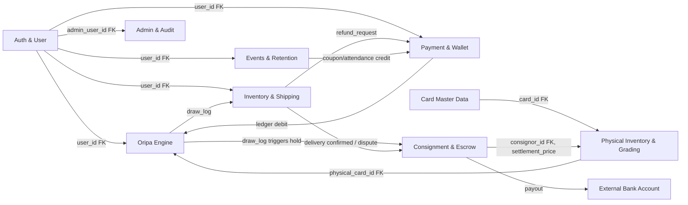
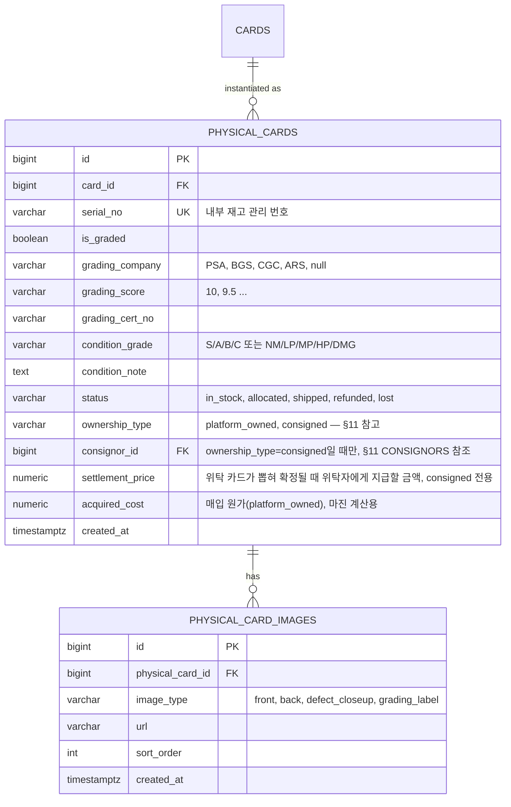
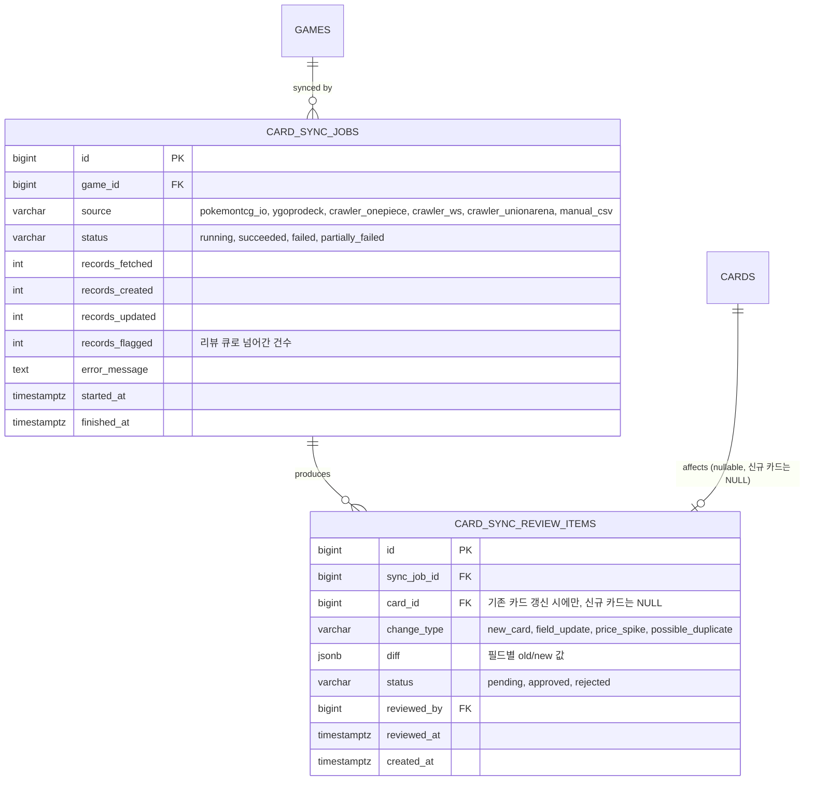

# TCG 오리파 플랫폼 — ERD (데이터 모델 설계)

프로젝트 계획서(§2, §3, §4, §5, §7)를 기반으로 한 엔티티 관계 설계. DB는 PostgreSQL 16을 기준으로 하며,
게임별 가변 속성은 JSONB로, 상태값은 Postgres ENUM 타입으로 표현한다. 모든 테이블은 `id BIGINT
GENERATED ALWAYS AS IDENTITY PK`, `created_at timestamptz DEFAULT now()`를 공통으로 가진다(표에서는
생략하지 않고 명시).

## 목차

1. [전체 도메인 개요](#1-전체-도메인-개요)
2. [Auth & User](#2-auth--user)
3. [Card Master Data](#3-card-master-data)
4. [Physical Inventory & Grading](#4-physical-inventory--grading)
5. [Oripa (뽑기) Engine](#5-oripa-뽑기-engine)
6. [User Inventory & Shipping](#6-user-inventory--shipping)
7. [Payment & Wallet (복식 원장)](#7-payment--wallet-복식-원장)
8. [Events & Retention](#8-events--retention)
9. [Admin & Audit](#9-admin--audit)
10. [Card Data Collection Pipeline (운영 데이터 수집)](#10-card-data-collection-pipeline-운영-데이터-수집)
11. [Consignment & Marketplace Escrow (위탁 판매 & 정산 에스크로)](#11-consignment--marketplace-escrow-위탁-판매--정산-에스크로)
12. [Offline Store Check-in & Anti-Farming (오프라인 매장 체크인 & 채굴 방지)](#12-offline-store-check-in--anti-farming-오프라인-매장-체크인--채굴-방지)
13. [설계 노트](#13-설계-노트)

---

## 1. 전체 도메인 개요



- **Auth & User**: 전 도메인의 기준(anchor) 엔티티인 `users`를 소유.
- **Card Master Data → Physical Inventory**: 카드 마스터 1건에 실물 개체(`physical_cards`)가 N건 매핑(동일 카드라도 그레이딩/상태가 다른 개체가 여러 장 존재).
- **Physical Inventory → Oripa Engine**: 팩의 각 슬롯(`oripa_slots`)은 실물 카드 1장에 1:1로 고정 매핑되어 오버셀을 원천 차단.
- **Oripa Engine → Inventory & Shipping**: 뽑기 결과가 `user_inventory`로 이동, 이후 배송 또는 환급 분기.
- **Payment & Wallet**: 모든 포인트 증감(충전/뽑기 차감/환급/이벤트 지급)은 `ledger_entries`에 원자적으로 기록되며 `wallets.balance`는 파생 캐시.
- **Consignment & Escrow**: 위탁받은 실물 카드가 뽑히면(`draw_log`) 정산금이 즉시 지급되지 않고 `settlement_holds`에 보류되며, 배송 완료+검수 기간 통과 또는 구매자 분쟁 여부에 따라 위탁자에게 지급(payout)되거나 보류가 취소된다.

---

## 2. Auth & User

```mermaid
erDiagram
    USERS ||--o{ USER_ADDRESSES : has
    USERS ||--o{ REFRESH_TOKENS : has
    USERS ||--o| USER_2FA : has
    USERS ||--o{ USER_OAUTH_ACCOUNTS : links
    USERS ||--o{ USER_CHANGE_LOGS : "audited by"
    USERS ||--o{ VERIFICATION_CODES : requests

    USERS {
        bigint id PK
        varchar email UK "SNS 전용 가입은 provider 이메일로 채움, nullable 아님"
        varchar password_hash "nullable, SNS 전용 계정은 NULL, Argon2id"
        varchar nickname UK
        varchar phone_encrypted "AES-256 (KMS), nullable"
        varchar signup_method "email, kakao, naver, google, apple — 최초 가입 경로(통계/정책용, 불변)"
        varchar role "user, admin, super_admin"
        varchar status "active, suspended, withdrawn"
        timestamptz last_login_at
        timestamptz created_at
        timestamptz updated_at
    }

    USER_ADDRESSES {
        bigint id PK
        bigint user_id FK
        varchar recipient_name
        varchar phone_encrypted
        varchar zipcode
        varchar address1_encrypted
        varchar address2_encrypted
        boolean is_default
        timestamptz created_at
    }

    REFRESH_TOKENS {
        bigint id PK
        bigint user_id FK
        varchar token_hash UK "SHA-256(token), raw token never stored"
        varchar device_info
        varchar ip_address
        timestamptz expires_at
        timestamptz revoked_at
        timestamptz created_at
    }

    USER_2FA {
        bigint id PK
        bigint user_id FK
        varchar secret_encrypted "TOTP seed, KMS-encrypted"
        boolean enabled
        timestamptz enabled_at
    }

    USER_OAUTH_ACCOUNTS {
        bigint id PK
        bigint user_id FK
        varchar provider "kakao, naver, google, apple"
        varchar provider_user_id UK "provider+provider_user_id 복합 UNIQUE"
        varchar email_from_provider
        boolean email_verified_by_provider
        timestamptz connected_at
        timestamptz last_used_at
    }

    USER_CHANGE_LOGS {
        bigint id PK
        bigint user_id FK
        varchar field "email, phone, password, nickname, address, status, role ..."
        varchar old_value_masked
        varchar new_value_masked
        varchar changed_by "self, admin"
        bigint admin_user_id FK "changed_by=admin일 때만"
        varchar ip_address
        timestamptz created_at
    }

    VERIFICATION_CODES {
        bigint id PK
        bigint user_id FK
        varchar purpose "email_change, phone_change, signup_email, password_reset"
        varchar target "변경 대상 이메일/전화번호"
        varchar code_hash "SHA-256(code), 평문 미저장"
        int attempt_count
        timestamptz expires_at "발급 후 5~10분"
        timestamptz verified_at
        timestamptz created_at
    }
```



**설계 포인트**
- Refresh Token Rotation: 매 갱신 시 기존 토큰 `revoked_at` 세팅 후 신규 행 삽입. 탈취 감지를 위해 재사용 시도 시 해당 유저의 전체 세션 강제 만료.
- 배송지는 컬럼 단위 암호화(AES-256, KMS). 인덱싱이 필요한 zipcode만 평문 유지.
- `role`은 admin 전용 라우트 게이트에 사용, 세분화된 권한은 §9 `admin_permissions` 참고.
- **SNS 계정은 `user_oauth_accounts`로 분리**(1:N) — 기존 `users.oauth_provider/oauth_id` 단일 컬럼 설계로는 한 유저가 카카오+네이버를 동시에 연결할 수 없어 확장. `UNIQUE(provider, provider_user_id)`로 동일 SNS 계정의 중복 유저 생성을 방지.
- **계정 연결(Account Linking)**: SNS 최초 로그인 시 `email_from_provider`가 기존 `users.email`과 일치하고 `email_verified_by_provider = true`인 경우에만 자동 연결 제안. 그렇지 않으면 신규 계정으로 분리 생성(이메일 스푸핑 방지) — §API 명세 3.항 참고.
- 이메일/전화번호 변경, 비밀번호 변경 등 민감 정보 수정은 `verification_codes`로 2단계 인증 후 확정하며, 성공 여부와 무관하게 `user_change_logs`에 감사 기록(본인 변경 포함 — 계정 탈취 대응 근거자료).

---

## 3. Card Master Data


**설계 포인트**
- `cards.attributes`(JSONB)로 게임별 스키마 차이를 흡수 — 별도 마이그레이션 없이 신규 게임 추가 가능.
- `(card_set_id, card_number)` 복합 UNIQUE로 동일 세트 내 중복 등록 방지.
- `source`로 API 동기화/크롤링/수동 입력 이력을 구분해 배치 재동기화 시 수동 보정 데이터 덮어쓰기 방지.

---

## 4. Physical Inventory & Grading



**설계 포인트**
- `physical_cards`가 실물 재고의 **단일 진실 공급원(SSOT)**. `oripa_slots.physical_card_id`가 여기를 참조하므로 슬롯:실물 = 1:1이 DB 레벨(UNIQUE 제약)로 강제됨.
- `status = allocated`는 팩에 배치되었지만 아직 안 뽑힌 상태, `shipped`/`refunded`는 §6 인벤토리 처리 결과와 동기화.
- 실물 촬영 이미지는 관리자 업로드 시 리사이즈·워터마크 파이프라인(Celery)을 거쳐 `physical_card_images`에 다건 저장.
- `ownership_type=consigned` 카드는 `consignor_id`/`settlement_price`가 채워지며, 뽑힌 뒤 정산 보류(에스크로) 흐름을 탄다 — 상세 설계는 §11.

---

## 5. Oripa (뽑기) Engine

```mermaid
erDiagram
    GAMES ||--o{ ORIPA_PACKS : "themed for"
    ORIPA_PACKS ||--o{ ORIPA_SLOTS : contains
    PHYSICAL_CARDS ||--|| ORIPA_SLOTS : "allocated 1:1"
    USERS ||--o{ DRAW_LOGS : performs
    ORIPA_PACKS ||--o{ DRAW_LOGS : records
    ORIPA_SLOTS ||--|| DRAW_LOGS : "consumed as"

    ORIPA_PACKS {
        bigint id PK
        bigint game_id FK
        varchar name
        text description
        int total_slots
        numeric price_per_draw
        varchar status "draft, on_sale, sold_out, settled"
        boolean last_one_bonus_enabled
        varchar server_seed_hash "SHA-256(server_seed), on_sale 전 공개(commit)"
        varchar server_seed "sold_out 후 공개(reveal), 그 전까지 NULL"
        timestamptz published_at
        timestamptz revealed_at
        bigint created_by FK
        timestamptz created_at
    }

    ORIPA_SLOTS {
        bigint id PK
        bigint pack_id FK
        int slot_no UK "pack_id + slot_no 복합 UNIQUE"
        varchar grade "SS, S, A, participation"
        bigint physical_card_id FK UK "실물 1:1, 슬롯 재사용 불가"
        varchar status "available, drawn"
        bigint drawn_by_user_id FK
        timestamptz drawn_at
    }

    DRAW_LOGS {
        bigint id PK
        bigint user_id FK
        bigint pack_id FK
        bigint slot_id FK UK
        varchar payment_method "points, free_ticket"
        numeric points_spent "payment_method=points일 때만"
        bigint free_draw_ticket_id FK "payment_method=free_ticket일 때만, §8 참조"
        varchar random_proof "CSPRNG 선택 인덱스 + 잔여슬롯수, 감사용"
        varchar ledger_entry_ref FK "ledger_entries.id, nullable(무료뽑기권 소비 시)"
        timestamptz drawn_at
    }
```

**설계 포인트 — Provably Fair**
1. **커밋(Commit)**: 팩 생성 시 `secrets` 기반 Fisher-Yates로 슬롯↔등급↔실물 매핑을 셔플하고, 전체 매핑 데이터 + `server_seed`의 해시(`server_seed_hash = SHA256(server_seed || mapping)`)를 `on_sale` 전환 시점에 선공개.
2. **소비**: 개별 뽑기는 `SELECT ... FOR UPDATE SKIP LOCKED` + Redis 분산 락(`pack:{id}:lock`)으로 동시성 제어 후, 잔여 `available` 슬롯 중 `secrets.randbelow(remaining_count)`로 균등 추출 → 오버셀·중복 뽑기 불가.
3. **리빌(Reveal)**: `status = settled` 전환 시 `server_seed` 공개 → 누구나 최초 커밋 해시와 대조해 매핑 조작 여부 검증 가능 (API: `GET /oripa-packs/{id}/proof`).
4. `draw_logs`는 append-only(UPDATE/DELETE 금지, DB 권한으로 강제) 감사 로그.
5. `payment_method=free_ticket`인 뽑기는 `free_draw_tickets.status`를 `used`로 전환하고 포인트 차감이 없다(§8 이벤트 보상 연동).

---

## 6. User Inventory & Shipping

```mermaid
erDiagram
    USERS ||--o{ USER_INVENTORY : owns
    PHYSICAL_CARDS ||--|| USER_INVENTORY : "held as"
    USERS ||--o{ SHIPPING_REQUESTS : requests
    USER_ADDRESSES ||--o{ SHIPPING_REQUESTS : "ships to"
    SHIPPING_REQUESTS ||--o{ SHIPPING_REQUEST_ITEMS : contains
    USER_INVENTORY ||--o| SHIPPING_REQUEST_ITEMS : included
    USER_INVENTORY ||--o| REFUND_REQUESTS : "refunded via"
    USER_INVENTORY ||--o| DELIVERY_DISPUTES : "disputed via"

    USER_INVENTORY {
        bigint id PK
        bigint user_id FK
        bigint physical_card_id FK UK
        varchar source "draw, purchase, event"
        bigint source_ref_id "draw_logs.id 등"
        varchar status "held, shipping_requested, shipped, delivered, confirmed, disputed, refunded"
        timestamptz acquired_at
    }

    SHIPPING_REQUESTS {
        bigint id PK
        bigint user_id FK
        bigint address_id FK
        varchar status "requested, preparing, shipped, delivered, confirmed, cancelled"
        varchar carrier
        varchar tracking_number
        timestamptz requested_at
        timestamptz shipped_at
        timestamptz delivered_at
        timestamptz inspection_deadline_at "delivered_at + N일, 위탁 카드 정산 보류 해제 기준(§11)"
        timestamptz confirmed_at "구매자 명시적 수령 확인 또는 기한 경과 자동 확정"
    }

    DELIVERY_DISPUTES {
        bigint id PK
        bigint user_inventory_id FK
        bigint user_id FK
        varchar reason "wrong_item, condition_mismatch, damaged, not_received"
        jsonb evidence "구매자 제출 사진/설명"
        varchar status "open, resolved_reship, resolved_refund, resolved_no_fault, resolved_penalize_consignor"
        bigint resolved_by FK
        timestamptz resolved_at
        timestamptz created_at
    }

    SHIPPING_REQUEST_ITEMS {
        bigint id PK
        bigint shipping_request_id FK
        bigint user_inventory_id FK UK
    }

    REFUND_REQUESTS {
        bigint id PK
        bigint user_inventory_id FK UK
        bigint user_id FK
        numeric refund_points
        varchar status "pending, approved, rejected, paid"
        timestamptz requested_at
        timestamptz processed_at
    }
```

**설계 포인트**
- `user_inventory.physical_card_id`에 UNIQUE 제약 → 동일 실물 카드가 두 유저 인벤토리에 동시 존재 불가.
- 배송 신청은 여러 인벤토리 항목을 하나의 `shipping_requests`로 묶어(§8 "배송 통합") 배송비 절감.
- 환급 선택 시 `refund_requests.status = paid` 전환과 동시에 `ledger_entries`에 `refund_credit` 항목 생성 (§7).
- **수령 확인/검수 기간**: `delivered_at` 이후 `inspection_deadline_at`까지 구매자가 이의를 제기하지 않으면 자동으로 `confirmed_at`이 채워진다(또는 구매자가 직접 조기 확정). 이 시점이 위탁 카드의 정산 보류(`settlement_holds`) 해제 트리거다 — 상세는 §11.
- `delivery_disputes`는 위탁/플랫폼 소유 카드 모두에 적용되는 공통 이의제기 창구이며, `consignor_id`가 있는 케이스는 처리 결과에 따라 §11의 정산 보류가 취소·차감될 수 있다.

---

## 7. Payment & Wallet (복식 원장)

포인트는 **유상(paid) / 무상(bonus)** 두 버킷으로 분리한다. 유상 잔액은 실제 충전한 돈이라 전자상거래법상 청약철회·환불
대상이지만, 무상 적립금(출석/미션/이벤트/계좌이체 보너스 등으로 지급)은 환불 대상이 아니며 만료가 있다 — 이 구분이 없으면
"이벤트로 받은 적립금까지 현금 환불해줘야 하는" 법적 리스크가 생긴다.

```mermaid
erDiagram
    USERS ||--|| WALLETS : owns
    WALLETS ||--o{ LEDGER_ENTRIES : records
    WALLETS ||--o{ BONUS_CREDIT_GRANTS : "accrues"
    USERS ||--o{ PAYMENT_TRANSACTIONS : makes
    PAYMENT_TRANSACTIONS ||--o| CHARGE_BONUS_RULES : "may apply"

    WALLETS {
        bigint id PK
        bigint user_id FK UK
        numeric paid_balance "유상 잔액(충전액), 환불 대상, 파생 캐시"
        numeric bonus_balance "무상 적립금, 환불 불가, 파생 캐시"
        timestamptz updated_at
    }

    LEDGER_ENTRIES {
        bigint id PK
        bigint wallet_id FK
        varchar entry_type "charge, draw_spend, refund_credit, bonus_grant, bonus_expired, adjustment, withdrawal"
        varchar balance_type "paid, bonus — 어느 버킷에 영향을 주는지"
        numeric amount "부호: +적립 / -차감"
        numeric balance_after
        varchar ref_type "payment_transaction, draw_log, refund_request, coupon_redemption, bonus_credit_grant"
        bigint ref_id
        varchar idempotency_key UK
        timestamptz created_at
    }

    BONUS_CREDIT_GRANTS {
        bigint id PK
        bigint wallet_id FK
        varchar source_type "attendance, mission, transfer_bonus, coupon, offline_checkin, admin_grant"
        bigint source_ref_id
        numeric amount
        numeric remaining_amount "소진 추적, 뽑기 시 무상 우선 차감(FIFO by expires_at)"
        timestamptz expires_at
        timestamptz created_at
    }

    CHARGE_BONUS_RULES {
        bigint id PK
        varchar method "transfer, card, kakaopay, naverpay"
        numeric bonus_rate "예: 0.03 = 충전액의 3% 적립"
        numeric min_charge_amount
        numeric max_bonus_amount "1회 최대 적립 한도"
        timestamptz valid_from
        timestamptz valid_to
        boolean is_active
        timestamptz created_at
    }

    PAYMENT_TRANSACTIONS {
        bigint id PK
        bigint user_id FK
        varchar pg_provider "portone(통합 게이트웨이, 기본값)"
        varchar sub_pg "nhn_kcp, kg_inicis, toss, kakaopay — 실제 라우팅된 하위 PG, API_SPEC.md §5.1 참고"
        varchar pg_tid UK
        numeric amount
        varchar method "card, transfer, kakaopay, naverpay"
        varchar status "pending, approved, failed, cancelled"
        bigint applied_bonus_rule_id FK
        jsonb webhook_payload
        timestamptz requested_at
        timestamptz approved_at
    }
```

**설계 포인트**
- `wallets.paid_balance`/`bonus_balance`는 성능을 위한 캐시이며, 정합성 검증 배치가 주기적으로 `SUM(ledger_entries.amount) GROUP BY balance_type`과 대조.
- 모든 포인트 증감은 `ledger_entries` 삽입 + `wallets` 갱신을 **하나의 DB 트랜잭션**으로 처리.
- `idempotency_key` UNIQUE 제약으로 PG 웹훅 재전송/중복 충전 요청을 DB 레벨에서 차단.
- `payment_transactions.pg_tid` UNIQUE로 동일 PG 거래 중복 승인 방지.
- **계좌이체 유도**: `charge_bonus_rules`에 `method=transfer` 규칙을 활성화하면, 계좌이체 충전 승인 시 `bonus_rate`만큼 `bonus_credit_grants`(`source_type=transfer_bonus`)가 자동 지급된다. 계좌이체 PG 수수료(약 1.8%)가 카드(3.4%+)보다 낮으므로(§API_SPEC §5.1), 절감분 일부를 즉시 무상 적립금으로 돌려주는 구조 — 환불 시에는 이 무상분은 회수되고 유상 충전액만 환불된다.
- **소진 우선순위**: 뽑기(`draw_spend`) 시 `bonus_balance`를 먼저 차감(만료 임박한 `bonus_credit_grants`부터 FIFO)하고, 소진되면 `paid_balance`를 차감 — 유저 입장엔 무상 적립금이 먼저 없어지는 게 유리하고, 플랫폼 입장엔 환불 의무가 있는 유상 잔액을 최대한 보존할 수 있다.
- `bonus_credit_grants.expires_at` 경과분은 배치가 `remaining_amount`를 0으로 만들며 `ledger_entries`에 `bonus_expired` 기록.

---

## 8. Events & Retention

```mermaid
erDiagram
    USERS ||--o{ ATTENDANCE_LOGS : checks_in
    ATTENDANCE_REWARD_POLICIES ||--o{ ATTENDANCE_LOGS : "generates reward via"
    ATTENDANCE_REWARD_POLICIES ||--o{ ATTENDANCE_LUCKY_BOX_OUTCOMES : defines
    USERS ||--o{ COUPON_REDEMPTIONS : redeems
    COUPONS ||--o{ COUPON_REDEMPTIONS : "redeemed by"
    USERS ||--o{ REFERRALS : refers
    USERS ||--o{ RANKING_SNAPSHOTS : ranked
    USERS ||--o{ USER_MISSIONS : progresses
    MISSION_DEFINITIONS ||--o{ USER_MISSIONS : defines
    USERS ||--|| USER_LOYALTY_STATUS : has
    LOYALTY_TIERS ||--o{ USER_LOYALTY_STATUS : "achieved by"
    USERS ||--o{ FREE_DRAW_TICKETS : holds
    LOYALTY_TIERS ||--o{ COSMETIC_ITEMS : "unlocks at"
    USERS ||--o{ USER_COSMETIC_UNLOCKS : owns
    COSMETIC_ITEMS ||--o{ USER_COSMETIC_UNLOCKS : "unlocked as"
    USERS ||--|| USER_PROFILE_EQUIPMENT : has

    ATTENDANCE_LOGS {
        bigint id PK
        bigint user_id FK
        date check_in_date UK "user_id+date 복합 UNIQUE"
        int streak_count
        int attendance_day_number "가입/최근 리셋 이후 누적 출석일수 — 마일스톤(10/20일차 등) 판정 기준"
        varchar reward_source "dynamic, milestone, lucky_box"
        varchar reward_type "bonus_credit, free_draw_ticket"
        numeric reward_value
        numeric activity_score_snapshot "보상 계산에 쓰인 가중합 점수, 재현/감사용"
        timestamptz created_at
    }

    ATTENDANCE_REWARD_POLICIES {
        bigint id PK
        numeric base_reward_amount "활동 없는 최소 기준 보상"
        numeric payment_recency_weight "최근 결제 이력 반영 가중치"
        numeric streak_weight "연속 출석일수 반영 가중치"
        numeric engagement_weight "뽑기 횟수/미션 완료 등 기타 이용 반영 가중치"
        int decay_start_days "무결제 상태 지속 시 감소가 시작되는 시점"
        int decay_window_days "감소가 바닥값까지 도달하는 기간 — 길게 잡아 하루 변화폭을 체감 못하게 함"
        numeric decay_floor_multiplier "바닥값, 예: 0.7 — 뚝 떨어지지 않고 은근히만 줄어듦"
        jsonb milestone_days "예: [7, 10, 20, 30, 50, 100]"
        numeric milestone_bonus_multiplier "마일스톤 날 보상 배율"
        int long_term_free_threshold_days "이 일수 이상 무결제 지속 시 럭키박스 방식으로 전환"
        boolean long_term_free_lucky_box_enabled
        boolean is_active
        timestamptz valid_from
        timestamptz valid_to
    }

    ATTENDANCE_LUCKY_BOX_OUTCOMES {
        bigint id PK
        bigint policy_id FK
        varchar outcome_code "small, medium, jackpot"
        numeric probability "policy_id 내 합계 1.0"
        varchar reward_type "bonus_credit, free_draw_ticket"
        numeric reward_value
        boolean is_active
    }

    COUPONS {
        bigint id PK
        varchar code UK
        varchar type "fixed_points, percent_bonus, free_draw"
        numeric value
        timestamptz valid_from
        timestamptz valid_to
        int max_uses
        int per_user_limit
        timestamptz created_at
    }

    COUPON_REDEMPTIONS {
        bigint id PK
        bigint coupon_id FK
        bigint user_id FK
        timestamptz redeemed_at
    }

    REFERRALS {
        bigint id PK
        bigint referrer_user_id FK
        bigint referred_user_id FK UK
        varchar status "pending, rewarded"
        timestamptz created_at
        timestamptz rewarded_at
    }

    RANKING_SNAPSHOTS {
        bigint id PK
        bigint user_id FK
        varchar period_type "daily, weekly, monthly"
        varchar period_key "예: 2026-W29"
        numeric score
        int rank
        timestamptz computed_at
    }

    MISSION_DEFINITIONS {
        bigint id PK
        varchar code UK
        varchar name
        varchar trigger_type "first_charge, first_draw, daily_login, n_draws_in_day, invite_friend, transfer_charge"
        int target_count "예: n_draws_in_day=3"
        varchar reward_type "bonus_credit, free_draw_ticket"
        numeric reward_value
        timestamptz valid_from
        timestamptz valid_to
        boolean is_active
    }

    USER_MISSIONS {
        bigint id PK
        bigint user_id FK
        bigint mission_id FK
        int progress_count
        varchar status "in_progress, completed, reward_claimed"
        timestamptz completed_at
        timestamptz reward_claimed_at
    }

    LOYALTY_TIERS {
        bigint id PK
        varchar tier_code UK "basic, bronze, silver, gold, vip — 순수 결제 등급 사다리"
        numeric min_cumulative_charge "누적 유상 충전액 기준, basic=0"
        jsonb benefits "배송비 할인율, 전용 이벤트, 등급전용 팩 접근 등 — 결제 이력과 무관한 출석 보상과는 별개"
    }

    USER_LOYALTY_STATUS {
        bigint id PK
        bigint user_id FK UK
        bigint tier_id FK
        numeric cumulative_charge_amount "누적 유상 충전액 — 결제등급과 출석 동적 보상 계산 양쪽의 입력값"
        numeric cumulative_free_offline_bonus "오프라인 체크인으로 받은 무상 적립금 누적, §12 채굴방지 규칙에 사용"
        timestamptz last_charge_at "가장 최근 유상 충전 시각 — 출석 보상 decay 계산 기준"
        timestamptz tier_achieved_at
        timestamptz updated_at
    }

    COSMETIC_ITEMS {
        bigint id PK
        varchar code UK
        varchar name
        varchar item_type "profile_frame, profile_badge, animated_deco"
        varchar asset_format "webp, gif, png"
        varchar asset_url
        bigint min_tier_required FK "이 등급 이상 달성 시 자동 unlock, nullable(이벤트 전용 아이템)"
        boolean is_active
        timestamptz created_at
    }

    USER_COSMETIC_UNLOCKS {
        bigint id PK
        bigint user_id FK
        bigint cosmetic_item_id FK
        varchar source "tier_achieved, event, admin_grant — 출석 경로 없음(§8 참고)"
        bigint source_ref_id
        timestamptz unlocked_at
    }

    USER_PROFILE_EQUIPMENT {
        bigint id PK
        bigint user_id FK UK
        bigint equipped_frame_id FK "COSMETIC_ITEMS 참조, nullable"
        bigint equipped_badge_id FK "nullable"
        bigint equipped_avatar_deco_id FK "nullable"
        timestamptz updated_at
    }

    FREE_DRAW_TICKETS {
        bigint id PK
        bigint user_id FK
        varchar source_type "attendance, mission, coupon, admin_grant"
        bigint source_ref_id
        varchar pack_scope "any, game:pokemon, pack:{id} — 사용 가능 범위"
        varchar status "available, used, expired"
        timestamptz expires_at
        timestamptz used_at
        timestamptz created_at
    }
```

**설계 포인트**
- `attendance_logs`는 `(user_id, check_in_date)` UNIQUE로 하루 중복 출석 방지, `streak_count`는 전일 미출석 시 배치/트리거로 리셋.
- `ranking_snapshots`는 실시간 집계 대신 주기적 배치 스냅샷(랭킹 조작·부하 방지), 실시간 뽑기 피드는 별도 WebSocket 채널(§API 명세 참고)로 처리하며 영속 저장하지 않음.
- **미션 시스템**: `mission_definitions`는 관리자가 트리거 조건과 보상을 정의하는 템플릿, `user_missions`가 유저별 진행도를 추적. 뽑기/충전/친구초대 등 이벤트 발생 시 해당 유저의 `user_missions.progress_count`를 증가시키고 `target_count` 도달 시 `completed`로 전환(보상은 별도 청구 API로 명시적 수령 — 자동 지급하지 않아 "받았는지 모르고 방치" 방지 및 UX 상 보상 연출 여지 확보).
- **무료 뽑기권**: `free_draw_tickets`는 출석/미션/쿠폰으로 지급되는 "뽑기 1회 무료" 아이템. `pack_scope`로 특정 게임/팩에만 쓰게 제한 가능. 뽑기 API(`POST /oripa-packs/{id}/draws`)가 `ticket_id`를 받으면 포인트 차감 대신 이 티켓을 소비 — 상세는 API_SPEC.md §3, §6 참고.

**설계 포인트 — 활동 기반 동적 출석 보상 & "눈치채지 못하게" 줄어드는 무결제 보상**
- 고정된 날짜별 보상 테이블 대신, 매 체크인마다 `attendance_reward_policies`의 가중치로 그 유저의 **결제 이력**(`last_charge_at`/`cumulative_charge_amount`), **연속 출석일수**(`streak_count`), **기타 이용도**(뽑기 횟수, 완료한 미션 수 등)를 합산한 `activity_score`를 계산해 보상을 그때그때 산출한다. `attendance_logs.activity_score_snapshot`에 계산근거를 남겨 재현·감사가 가능하다.
- **서서히, 감지 못하게 감소**: 무결제 상태가 `decay_start_days`(예: 15일)를 넘기면 그 즉시 확 줄이는 게 아니라, `decay_window_days`(예: 90일)에 걸쳐 서서히 `decay_floor_multiplier`(예: 0.7)까지 하락시킨다 — 하루 변화폭이 1% 미만이라 유저가 "오늘 갑자기 줄었다"고 체감하지 못한다. 절벽형 등급 강등은 두지 않는다.
- **마일스톤 스파이크**: `milestone_days`(예: 7·10·20·30·50·100일차)에는 결제 여부와 무관하게 `milestone_bonus_multiplier`를 곱한 고가치 보상을 지급해 장기 이탈을 방지하고 "다음 마일스톤까지 채워야지" 하는 동기를 유지시킨다.
- **장기 무결제자 = 확정형 → 확률형(럭키박스) 전환**: `long_term_free_threshold_days`를 넘긴 무결제 유저는 보상 방식이 `attendance_lucky_box_outcomes`의 확률 테이블로 전환된다. 예: 90% 확률로 소액, 9% 확률로 중간값, 1% 확률로 잭팟(고가 무료뽑기권) — 산술적 기댓값은 일반 확정형 보상보다 높게 설계할 수 있지만, 실제로는 대부분(90%) 소액만 받으므로 체감가치·실사용 필요성은 낮다. "당첨되면 크다"는 기대감으로 이탈은 막으면서, 평균 지급원가는 낮게 통제하는 구조다.
- **결제 관련 혜택은 그대로**: 위 감소/럭키박스 전환은 오직 **출석 보상**에만 적용된다. 배송비 할인, 충전 보너스(§7 `charge_bonus_rules`), PG 결제 조건 등 결제와 관련된 혜택·조건은 결제 이력과 무관하게 모든 유저에게 동일하게 적용한다 — 장기 무결제자를 다른 영역에서까지 차별하지 않는다.

**설계 포인트 — 로열티 등급 & 코스메틱 (출석 보상과는 완전히 분리)**
- `loyalty_tiers`는 순수하게 **누적 유상 충전액** 기준의 결제 등급 사다리(`basic → bronze → silver → gold → vip`)이며, 위 출석 보상의 증감 로직과는 무관하다.
- **코스메틱은 등급 달성 시에만 자동 지급**: `cosmetic_items.min_tier_required` 등급에 도달하면 배치/트리거가 즉시 `user_cosmetic_unlocks`를 생성한다(`source=tier_achieved`) — 출석 체크인을 통한 코스메틱 지급 경로는 없다. 애니메이션(webp/gif) 프로필 장식처럼 원가 없는 "과시형" 보상을 결제 등급에만 묶어 결제 유도 효과를 낸다.
- `user_profile_equipment`는 보유(`user_cosmetic_unlocks`) 중 실제 착용 중인 것만 가리킨다.
- `user_cosmetic_unlocks`는 `(user_id, cosmetic_item_id)` UNIQUE로 중복 해금 방지(§13.3 참고).

---

## 9. Admin & Audit

```mermaid
erDiagram
    USERS ||--o{ AUDIT_LOGS : performs
    USERS ||--o| ADMIN_PERMISSIONS : has

    ADMIN_PERMISSIONS {
        bigint id PK
        bigint user_id FK UK
        varchar scope "card_admin, pack_admin, finance_admin, super_admin"
        timestamptz granted_at
    }

    AUDIT_LOGS {
        bigint id PK
        bigint admin_user_id FK
        varchar action "card.create, pack.settle, user.suspend, ..."
        varchar target_type
        bigint target_id
        jsonb before_state
        jsonb after_state
        varchar ip_address
        timestamptz created_at
    }
```

**설계 포인트**
- 관리자 액션(카드 등록, 팩 발행/정산, 유저 제재, 환급 승인 등)은 예외 없이 `audit_logs`에 before/after 스냅샷 기록.
- `audit_logs`도 append-only. 관리자 페이지는 별도 도메인/IP 화이트리스트 + 2FA 필수(§6 보안)이며 `admin_permissions.scope`로 세분화된 RBAC 적용.

---

## 10. Card Data Collection Pipeline (운영 데이터 수집)

카드 마스터 데이터(§3)를 최신 상태로 유지하기 위한 수집 파이프라인의 실행 이력·리뷰 큐 모델.
소스별 흐름과 API는 계획서 §3.1 및 `API_SPEC.md` §7.1을 참고.



`cards` 테이블에는 필드 단위 수동 잠금을 위한 컬럼을 추가한다 (§3 원본 정의에 대한 보강):

```
CARDS.locked_fields  jsonb   -- 예: {"rarity": true, "attributes.hp": true} — true인 필드는 자동 동기화가 덮어쓰지 않음
```

**소스별 수집 전략**

| 게임 | 수집 방식 | 주기 | 비고 |
|---|---|---|---|
| Pokemon | PokemonTCG.io REST API | 매일 03:00 (Celery beat) | 공식 API, 페이지네이션 + rate limit 준수 |
| Yu-Gi-Oh! | YGOPRODeck API | 매일 03:10 | 공식 API |
| One Piece | 공식 카드리스트 크롤러 + 관리자 수동 보정 | 주 1회 + 신규 세트 발매 시 수동 트리거 | robots.txt/ToS 확인, 요청 간격 제한 |
| Weiss Schwarz | 공식 DB 크롤러 + 수동 | 주 1회 | 상동 |
| Union Arena | 공식 DB 크롤러 + 수동 | 주 1회 | 상동 |

**파이프라인 동작 원칙**
1. 소스 fetch → 정규화(공통 스키마 매핑) → 기존 `cards`와 필드 단위 diff 계산.
2. `locked_fields`에 잠긴 필드는 diff에서 제외(관리자 수동 보정값 보호).
3. diff 규모가 임계치(예: 신규 카드 50건 이상, 특정 필드 가격/희귀도 급변)를 넘으면 **자동 반영하지 않고** `card_sync_review_items`에 적재 후 관리자 승인 대기.
4. 임계치 이하의 단순 갱신(오탈자 수정, 이미지 URL 갱신 등)은 즉시 반영, `card_sync_jobs.records_updated`에 카운트.
5. 동기화 실패/rate-limit 초과 시 `status=failed` + 관리자 알림(Slack/이메일), 재시도는 다음 스케줄 또는 수동 트리거.

---

## 11. Consignment & Marketplace Escrow (위탁 판매 & 정산 에스크로)

개인/외부 판매자가 실물 카드를 위탁 출품하는 마켓플레이스형 거래를 지원하기 위한 도메인. 구매자 보호(§6 검수 기간)와
**위탁자(판매자) 보호**를 동시에 만족시키는 양방향 에스크로 구조 — "뽑히면 즉시 지급"이 아니라 "배송·검수 통과 후 지급"이
핵심이다.

```mermaid
erDiagram
    CONSIGNORS ||--o{ CONSIGNMENT_SUBMISSIONS : submits
    CONSIGNORS ||--o{ PHYSICAL_CARDS : "owns (consigned)"
    PHYSICAL_CARDS ||--o| SETTLEMENT_HOLDS : "triggers on draw"
    DRAW_LOGS ||--o| SETTLEMENT_HOLDS : creates
    DELIVERY_DISPUTES ||--o| SETTLEMENT_HOLDS : "may reverse"
    CONSIGNORS ||--|| CONSIGNOR_WALLETS : has
    CONSIGNOR_WALLETS ||--o{ CONSIGNOR_LEDGER_ENTRIES : records
    CONSIGNORS ||--o{ CONSIGNOR_PAYOUTS : "cashed out via"

    CONSIGNORS {
        bigint id PK
        bigint user_id FK UK "위탁자도 플랫폼 회원이어야 함"
        varchar display_name
        varchar real_name_encrypted "AES-256 (KMS), 본인확인용"
        varchar id_verification_status "unverified, verified"
        varchar bank_account_encrypted "정산 계좌, AES-256 (KMS)"
        varchar tax_id_encrypted "원천징수 신고용 식별정보, AES-256 (KMS)"
        varchar status "pending, active, suspended"
        timestamptz created_at
    }

    CONSIGNMENT_SUBMISSIONS {
        bigint id PK
        bigint consignor_id FK
        bigint card_id FK "카드 마스터, §3 참조"
        jsonb submitted_images "위탁자 제출 사진"
        numeric requested_price "위탁자 희망가"
        numeric admin_assessed_settlement_price "관리자 심사 후 확정 정산가"
        numeric commission_rate "플랫폼 수수료율, 예: 0.15"
        varchar status "submitted, under_review, approved, rejected, withdrawn"
        bigint reviewed_by FK
        timestamptz reviewed_at
        timestamptz created_at
    }

    SETTLEMENT_HOLDS {
        bigint id PK
        bigint physical_card_id FK UK
        bigint draw_log_id FK
        bigint consignor_id FK
        numeric hold_amount "= admin_assessed_settlement_price × (1 - commission_rate)"
        varchar status "held, released, disputed, reversed"
        timestamptz hold_expires_at "배송완료(delivered_at) + 검수기간, §6 inspection_deadline_at와 동기화"
        timestamptz released_at
        timestamptz created_at
    }

    CONSIGNOR_WALLETS {
        bigint id PK
        bigint consignor_id FK UK
        numeric pending_balance "정산 보류 중 합계, 파생 캐시"
        numeric available_balance "출금 가능 합계, 파생 캐시"
        timestamptz updated_at
    }

    CONSIGNOR_LEDGER_ENTRIES {
        bigint id PK
        bigint consignor_id FK
        varchar entry_type "sale_hold, sale_release, payout, dispute_reversal, commission_fee"
        numeric amount "부호 있음"
        varchar ref_type "settlement_hold, delivery_dispute, consignor_payout"
        bigint ref_id
        timestamptz created_at
    }

    CONSIGNOR_PAYOUTS {
        bigint id PK
        bigint consignor_id FK
        numeric amount
        numeric withholding_tax_amount "기타소득 원천징수 등, 세무 규정에 따름"
        numeric net_amount
        varchar payout_status "pending, processing, paid, failed"
        varchar pg_payout_ref "지급대행 벤더 참조번호 (포트원 파트너 정산 자동화 우선, API_SPEC.md §5.1 참고)"
        timestamptz requested_at
        timestamptz paid_at
    }
```

**설계 포인트 — 정산 에스크로 흐름**
1. **위탁 심사**: 위탁자가 `consignment_submissions`로 카드+사진+희망가 제출 → 관리자가 실물 확인/그레이딩 후 `admin_assessed_settlement_price`, `commission_rate` 확정 → 승인 시 `physical_cards`에 `ownership_type=consigned`, `consignor_id`, `settlement_price`로 반영(§4).
2. **보류 생성**: 위탁 카드가 오리파에서 뽑히는 순간(`draw_logs` 생성 시점) `settlement_holds`가 `status=held`로 즉시 생성되고, 동시에 `consignor_ledger_entries`에 `sale_hold`(+`hold_amount`, pending) 기록 → `consignor_wallets.pending_balance` 증가. **이 시점엔 위탁자에게 실제 지급되지 않는다** — 구매자가 아직 실물을 받지 못했기 때문.
3. **보류 해제**: 배송 완료 후 `shipping_requests.confirmed_at`이 채워지면(구매자 명시적 확인 또는 §6 `inspection_deadline_at` 경과 자동 확정) `settlement_holds.status=released` 전환, `consignor_ledger_entries`에 `sale_release` 기록 → `pending_balance`에서 `available_balance`로 이동.
4. **분쟁 시 처리**: 검수 기간 내 `delivery_disputes`가 열리면 보류 해제가 정지된다. 위탁자 귀책(그레이딩/사진과 실물 불일치 등)으로 판정되면 `settlement_holds.status=reversed` + `dispute_reversal` 기록으로 보류 취소, 구매자는 재배송/환급을 플랫폼 자체 재고 또는 별도 보상 재원으로 처리(위탁자에게 책임을 전가하되 구매자 피해를 위탁자 귀책 확정까지 기다리게 하지 않음).
5. **출금**: `available_balance`가 쌓인 위탁자는 `consignor_payouts` 요청 → **플랫폼이 직접 계좌 이체하지 않고 지급대행 벤더(`pg_payout_ref`)를 경유** — 1순위는 세금계산서 자동발행까지 지원하는 포트원 파트너 정산 자동화, 위탁 거래량이 커지면 토스페이먼츠 지급대행(월 정액제)과 재비교(API_SPEC.md §5.1). 플랫폼이 임의 계좌로 직접 송금하면 전자금융거래법상 지급대행업 등록 이슈가 발생할 수 있어 반드시 라이선스가 있는 벤더를 경유.
6. 개인 위탁자 대상 지급은 세법상 원천징수(예: 기타소득 3.3%) 대상일 가능성이 높아 `consignor_payouts.withholding_tax_amount`로 분리 계산 — 정확한 세율/신고 의무는 세무사 자문 필요.

**법적 유의사항 (요약)**
- 위탁 판매 자체가 중고/위탁물품 취급 관련 별도 신고·등록 대상인지 사업 개시 전 법률 검토 필요(§리스크, 오리지널 계획서 §10).
- 위탁자 정산은 "지급대행 벤더 경유"가 원칙(포트원 파트너 정산 자동화 우선) — 직접 계좌이체 자체 구현 금지.
- 위탁자 개인정보(실명, 계좌, 세금 식별정보)는 §2와 동일하게 컬럼 단위 암호화(AES-256, KMS).

---

## 12. Offline Store Check-in & Anti-Farming (오프라인 매장 체크인 & 채굴 방지)

제휴 오프라인 카드샵 방문 시 무상 적립금을 지급해 오프라인 매장 유입을 유도하는 기능. **매장 측 QR 발급 기록**과
**고객 측 스캔 제출 기록**을 서로 다른 주체가 남기고 서버가 대조하는 이중 장부 구조로 실제 방문을 검증하며,
"돈은 안 쓰고 무료 적립금만 계속 채굴"하는 어뷰징을 막기 위한 누적 상한을 둔다.

```mermaid
erDiagram
    PARTNER_STORES ||--o{ STORE_QR_ISSUANCES : issues
    PARTNER_STORES ||--o{ STORE_CHECKINS : "visited via"
    STORE_QR_ISSUANCES ||--o| STORE_CHECKINS : "consumed by"
    USERS ||--o{ STORE_CHECKINS : performs
    STORE_CHECKINS ||--o{ OFFLINE_CHECKIN_FRAUD_FLAGS : "may flag"

    PARTNER_STORES {
        bigint id PK
        varchar name
        varchar address
        numeric latitude
        numeric longitude
        int geofence_radius_m "매장 반경, 예: 50m"
        varchar qr_secret_key "회전 QR 생성용 HMAC 시드"
        varchar status "pending, active, suspended, terminated"
        timestamptz created_at
    }

    STORE_QR_ISSUANCES {
        bigint id PK
        bigint store_id FK
        varchar qr_token UK "매장 태블릿/PC 화면에 표시되는 회전 토큰 — '장부 1' (매장측 기록)"
        timestamptz issued_at
        timestamptz expires_at "issued_at + 60초 등 짧은 주기로 재발급"
    }

    STORE_CHECKINS {
        bigint id PK
        bigint user_id FK
        bigint store_id FK
        bigint qr_issuance_id FK UK "스캔한 토큰, 1회만 소비(replay 방지) — '장부 2' (고객측 기록)"
        varchar device_id "디바이스 지문"
        numeric client_lat
        numeric client_lng
        numeric distance_from_store_m
        boolean device_integrity_verified "Android Play Integrity / iOS DeviceCheck 통과 여부"
        varchar status "verified, rejected, flagged"
        varchar rejected_reason
        timestamptz created_at
    }

    OFFLINE_CHECKIN_REWARD_RULES {
        bigint id PK
        int daily_limit_per_user
        int weekly_limit_per_user
        numeric reward_amount
        int cooldown_minutes "연속 체크인 간 최소 간격"
        numeric lifetime_free_cap_without_paid_charge "유상 충전 이력 없는 유저의 누적 무료지급 상한 — 채굴 방지 핵심"
        boolean is_active
        timestamptz valid_from
        timestamptz valid_to
    }

    OFFLINE_CHECKIN_FRAUD_FLAGS {
        bigint id PK
        bigint checkin_id FK
        varchar flag_type "impossible_travel, device_multi_account, gps_mismatch, shop_anomaly"
        jsonb detail "탐지 근거(이전 체크인과의 거리/시간, 동일 device_id 목록 등)"
        varchar status "open, confirmed_fraud, cleared"
        bigint reviewed_by FK
        timestamptz reviewed_at
        timestamptz created_at
    }
```

**설계 포인트 — 이중 출석부(Dual-Ledger) 검증**
1. 매장에 설치된 태블릿/PC가 60초 주기로 서버로부터 새 QR을 발급받아 화면에 표시 — 이 발급 자체가 `store_qr_issuances`에 독립적으로 기록된다("장부 1", 매장측 실체 증명 — 그 시각 그 매장에 실제로 화면이 존재해야만 생성 가능).
2. 고객은 앱으로 그 QR을 스캔하고, 위치(GPS) + 디바이스 무결성 증명과 함께 서버에 제출 — `store_checkins`에 기록된다("장부 2", 고객측 제출).
3. 서버는 두 장부를 대조: `qr_issuance_id`가 실재하고 미만료·미사용이며, `client_lat/lng`가 매장 반경(`geofence_radius_m`) 내인 경우에만 `status=verified`로 확정 — 한쪽 장부만 조작(GPS 스푸핑만, 또는 QR 스크린샷 공유만)해서는 보상이 나가지 않는다.
4. `qr_issuance_id` UNIQUE로 동일 QR 토큰 재사용(스크린샷 돌려쓰기, 여러 계정이 같은 QR 제출) 원천 차단 — 토큰은 발급 후 짧은 주기 내 1인 1회만 소비 가능.
5. GPS는 그 자체로 모킹 가능하므로 OS 레벨 무결성 증명(Android Play Integrity API / iOS DeviceCheck)을 병행 — `device_integrity_verified=false`면 자동으로 `flagged` 처리, 보상은 검토 전까지 보류.
6. 검증 통과 + 일/주 한도 이내인 경우에만 `bonus_credit_grants`(`source_type=offline_checkin`, §7)로 무상 적립금 지급.

**설계 포인트 — 무료 적립금 채굴(Farming) 방지**
- **핵심 장치**: `offline_checkin_reward_rules.lifetime_free_cap_without_paid_charge` — `user_loyalty_status.cumulative_charge_amount`(§8, 유상 충전 누적)가 0인 유저의 `cumulative_free_offline_bonus`(오프라인 체크인 무상 적립금 누적)가 이 상한에 도달하면 더 이상 지급하지 않는다(`403 FREE_CREDIT_CAP_REACHED_REQUIRES_CHARGE`). 즉 "최소 1회 유상 충전"을 해야 그 이후로는 정상적인 일/주 한도로 계속 받을 수 있다 — 카드샵 방문만 반복해서 무한정 무료 재화를 채굴하는 경로를 구조적으로 막는다.
- **이상 탐지(비동기)**: 체크인 직후 Celery 잡이 (a) 직전 체크인과의 이동거리/시간으로 물리적으로 불가능한 이동인지(`impossible_travel`), (b) 동일 `device_id`가 여러 `user_id`로 체크인하는지(`device_multi_account`), (c) 동일 매장에서 짧은 시간 내 비정상적으로 많은 서로 다른 신규 계정이 몰리는지(`shop_anomaly`, 매장 결탁 의심)를 검사해 `offline_checkin_fraud_flags`에 적재. 의심 건은 지급을 보류하고 관리자 검토 후 `confirmed_fraud`면 회수(및 해당 유저/매장 체크인 자격 정지 검토), `cleared`면 지급 재개.
- 매장 등록(`partner_stores`) 자체도 관리자 승인제(`status=pending→active`)로 운영해, 아무 장소나 셀프 등록해 스스로 방문 처리하는 것을 방지.

---

## 13. 설계 노트

### 13.1 `cards.attributes` JSONB 스키마 예시 (게임별)

```jsonc
// Pokemon
{ "hp": 120, "type": "Fire", "evolves_from": "Charmeleon", "regulation_mark": "H" }

// Yu-Gi-Oh!
{ "attribute": "DARK", "level": 8, "atk": 2500, "def": 2100, "card_type": "Effect Monster" }

// One Piece Card Game
{ "cost": 5, "power": 6000, "counter": 1000, "color": ["Red"], "card_type": "Character" }

// Weiss Schwarz
{ "level": 2, "cost": 1, "power": 9500, "soul": 2, "trigger": "Soul" }

// Union Arena
{ "energy_cost": 3, "bp": 5000, "ap": 1, "affinity": "Attack" }
```
공통 컬럼(`rarity`, `card_number`, `name`)만 정규화하고 나머지는 JSONB로 흡수 → 신규 게임 추가 시 스키마 마이그레이션 불필요, 대신 애플리케이션 레벨(Pydantic discriminated union)에서 게임별 검증.

### 13.2 인덱스 전략(주요)
- `cards`: `(card_set_id, card_number)` UNIQUE, `attributes` GIN 인덱스(검색/필터용).
- `physical_cards`: `serial_no` UNIQUE, `status` 부분 인덱스(`WHERE status = 'in_stock'`) — 재고 조회 최적화.
- `oripa_slots`: `(pack_id, slot_no)` UNIQUE, `physical_card_id` UNIQUE, `(pack_id, status)` 부분 인덱스(`WHERE status='available'`) — 뽑기 시 잔여 슬롯 스캔 최적화.
- `ledger_entries`: `(wallet_id, created_at)` 복합 인덱스, `idempotency_key` UNIQUE.
- `draw_logs`, `audit_logs`: `created_at` BRIN 인덱스(append-only 대용량 로그).
- `settlement_holds`: `physical_card_id` UNIQUE, `(status, hold_expires_at)` 부분 인덱스(`WHERE status='held'`) — 검수기한 만료 배치 스캔용.
- `consignor_ledger_entries`: `(consignor_id, created_at)` 복합 인덱스.
- `bonus_credit_grants`: `(wallet_id, expires_at)` 부분 인덱스(`WHERE remaining_amount > 0`) — 만료 배치/FIFO 소진 스캔용.
- `user_missions`: `(user_id, mission_id)` UNIQUE.
- `free_draw_tickets`: `(user_id, status)` 부분 인덱스(`WHERE status='available'`), `expires_at` 만료 배치용.
- `store_qr_issuances`: `qr_token` UNIQUE, `expires_at` 만료 배치용.
- `store_checkins`: `qr_issuance_id` UNIQUE, `(user_id, created_at)` 복합 인덱스 — 일/주 한도 집계 및 이동거리 이상탐지용.
- `attendance_lucky_box_outcomes`: `policy_id` 인덱스, `SUM(probability) = 1.0`은 애플리케이션 레벨 검증(저장 전).
- `user_cosmetic_unlocks`: `(user_id, cosmetic_item_id)` UNIQUE.

### 13.3 동시성 & 정합성 강제 요약

| 요구사항 | 강제 방법 |
|---|---|
| 슬롯:실물 1:1 | `oripa_slots.physical_card_id` UNIQUE |
| 동일 슬롯 중복 뽑기 방지 | `SELECT FOR UPDATE SKIP LOCKED` + Redis 분산 락 + `draw_logs.slot_id` UNIQUE |
| 중복 충전/웹훅 재처리 방지 | `payment_transactions.pg_tid` UNIQUE, `ledger_entries.idempotency_key` UNIQUE |
| 포인트 잔액 위변조 방지 | `wallets.paid_balance`/`bonus_balance`는 트리거로만 갱신, 애플리케이션 직접 UPDATE 금지(뷰/함수 경유) |
| 무상 적립금 현금 환불 방지 | 환불(`refund_credit`)은 `balance_type='paid'` 항목에서만 계산, 환불 시 `bonus_balance`는 대상에서 제외 |
| 무료 뽑기권 중복 사용 방지 | `free_draw_tickets.status`는 상태머신(`available→used`)으로만 전이, `draw_logs.free_draw_ticket_id` UNIQUE |
| 동일 미션 중복 완료 처리 방지 | `user_missions.(user_id, mission_id)` UNIQUE |
| 감사 로그 불변성 | `draw_logs`, `audit_logs`, `user_change_logs`에 UPDATE/DELETE 권한 미부여 (append-only role) |
| 동일 SNS 계정 중복 가입 방지 | `user_oauth_accounts.(provider, provider_user_id)` UNIQUE |
| 인증 코드 재사용/무한 시도 방지 | `verification_codes.attempt_count` 임계치 초과 시 코드 폐기, `expires_at` 경과 시 무효 |
| 수동 보정 카드 데이터 덮어쓰기 방지 | `cards.locked_fields`에 잠긴 필드는 동기화 diff 계산에서 제외 |
| 위탁 카드 정산금 조기 유출 방지 | `settlement_holds`는 배송 확정(`confirmed_at`) 전까지 `released`로 전환 불가 (애플리케이션 레벨 상태머신 + 배치 검증) |
| 위탁자 정산 이중 지급 방지 | `consignor_payouts`는 `available_balance` 범위 내에서만 생성, 지급 완료 후 `consignor_ledger_entries`에 `payout` 차감 기록 |
| 동일 QR 토큰 재사용(리플레이) 방지 | `store_checkins.qr_issuance_id` UNIQUE, `store_qr_issuances.expires_at` 경과 토큰은 소비 불가 |
| 무료 적립금 무한 채굴 방지 | 유상 충전 이력(`cumulative_charge_amount`) 없는 유저는 `cumulative_free_offline_bonus`가 `lifetime_free_cap_without_paid_charge` 도달 시 오프라인 체크인 보상 지급 중단 |
| 장기 무결제자 출석 보상 감소가 결제 혜택까지 침범하지 않도록 격리 | `attendance_reward_policies`/`attendance_lucky_box_outcomes`는 `bonus_credit_grants`(§7)만 갱신, `loyalty_tiers.benefits`·`charge_bonus_rules`(결제 혜택)는 별도 경로로 절대 참조하지 않음 |
| 럭키박스 확률 합계 오류 방지 | `attendance_lucky_box_outcomes` 저장 시 `SUM(probability) = 1.0` 애플리케이션 검증, 불일치 시 저장 거부 |
| 코스메틱 중복 해금 방지 | `user_cosmetic_unlocks.(user_id, cosmetic_item_id)` UNIQUE |
